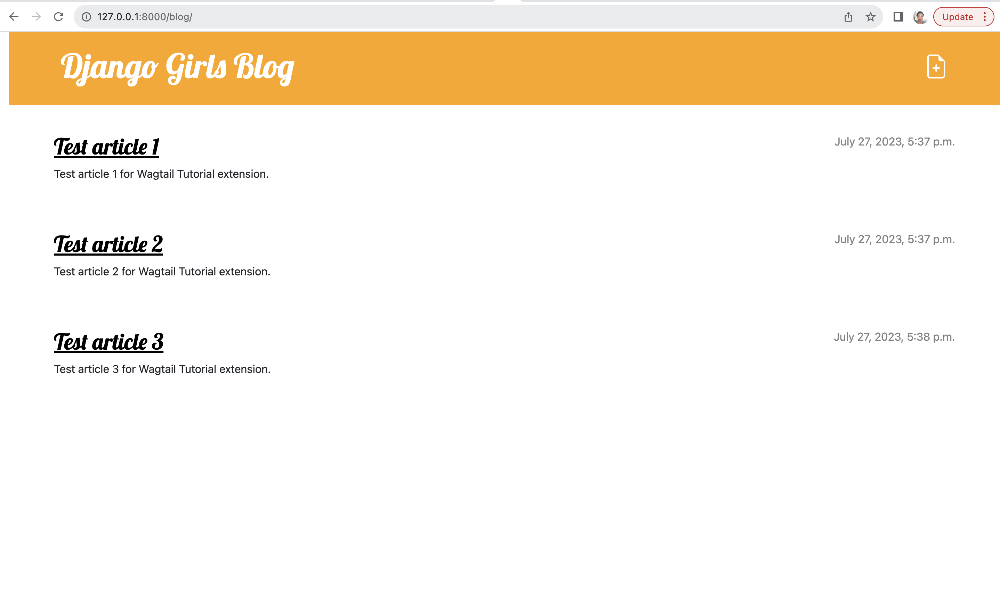

# Change Website Homepage to Wagtail Blog Homepage

The Wagtail admin has a nicer and a more user-friendly interface compared to the default Django admin user interface. 
For this reason, we would rather use our Wagtail blog as our main blog and ignore the blog we created in the main 
tutorial. 

We will not remove our initial blog, we will leave it as it is as we may need to use it for more learning. We will
however change the root of our project to point to our Wagtail blog. Make the following changes to your 
`mysite/urls.py` as shown below:

First change the   `URL` for your first blog to the following:

```python
path('blog/', include('blog.urls')),
```

Next change the `URL` for the Wagtail blog to the following:

```python
path('', include(wagtail_urls)),
```

Your `mysite/urls.py` should now look like below:

 mysite/urls.py 
```python
from django.conf import settings
from django.conf.urls.static import static
from django.contrib import admin
from django.urls import include, path

from wagtail.admin import urls as wagtailadmin_urls
from wagtail import urls as wagtail_urls

urlpatterns = [
    path('admin/', admin.site.urls),
    path('blog/', include('blog.urls')),
    path('cms/', include(wagtailadmin_urls)),
    path('', include(wagtail_urls)),
] + static(settings.MEDIA_URL, document_root=settings.MEDIA_ROOT)

```

This will make your Wagtail accessible by visiting `http://127.0.0.1:8000` as shown below


and your first blog will now be at `http://127.0.0.1:8000/blog/` as shown below.



# Committing our changes to GitHub

Now that we have managed to get Wagtail working well with out blog, we can deploy our changes to our live website 
which we deployed to PythonAnywhere earlier on during the main tutorial. To do this, we need to first push our code to 
GitHub as we have done before by typing the following in our command line:

```
(myvenv) ~/djangogirls$ git status
```

This will list all the files we have changed. Once we have confirmed those are the changes we have made, we can go 
ahead and add the files to be committed by typing the following command:

```
(myvenv) ~/djangogirls$ git add .
```

Next we need to add a commit message for our changes to be saved by typing the following command:

```
(myvenv) ~/djangogirls$ git commit -m "Add Wagtail to our blog"
```

Lastly, we need to push the commit to GitHub by typing the following command:

```
(myvenv) ~/djangogirls$ git push origin HEAD
```

This will push our new changes to GitHub and we are now ready to deploy these changes to PythonAnywhere!

# Deploying the changes to PythonAnywhere
To deploy our changes to [PythonAnywhere](https://pythonanywhere.com) and click `Consoles` and click on 
`Bash Console in virtualenv` to open a new Bash console with an activated virtual environment and then type in the
following command:

```
$ git pull origin HEAD
```

This command will pull your changes from GitHub to your PythonAnywhere project.

Next, you need to update the requirements for your project by installing Wagtail and its dependencies. Since we 
updated our requirements file, you only need to type in the following command to install the required packages:

```
$ pip install -r requirements.txt
```

Next step is to run migrations for the new models and create the necessary tables in the database. To do this, type the 
following command:

```
$ python manage.py migrate
```

Next, you need to run the `collectstatic` command to copy the static files required by Wagtail to the `static` root 
folder specified in our `settings.py` file.

``` 
$ python manage.py collectstatic
```

Lastly, go to `Web` tab and reload your webapp by clicking the `Reload <your-username>.pythonanywhere.com` button and
open `https://<your-username.pythonanywhere.com` in another tab to see your blog now using Wagtail CMS.

You should get the `Welcome to your new Wagtail site!` on your homepage to show that Wagtail is now working as your
website root.

To change the root page of your Wagtail blog visit `https://<your-username.pythonanywhere.com/cms/` and login. 
Then follow the steps in [Changing the Wagtail Homepage](../wagtail_integration_adding_homepage/README.md#changing-homepage) section of this tutorial to create a new homepage and
change it to be the root of the blog.

To create new posts, follow instructions in the [Adding posts](../wagtail_integration_adding_posts/README.md#adding-blog-posts) section of this tutorial. 

That's all for this tutorial. If you want to learn more about Wagtail, you can read the 
[Wagtail documentation](https://guide.wagtail.org/en-latest/) or search for more tutorials on Wagtail online.

Happy coding!
