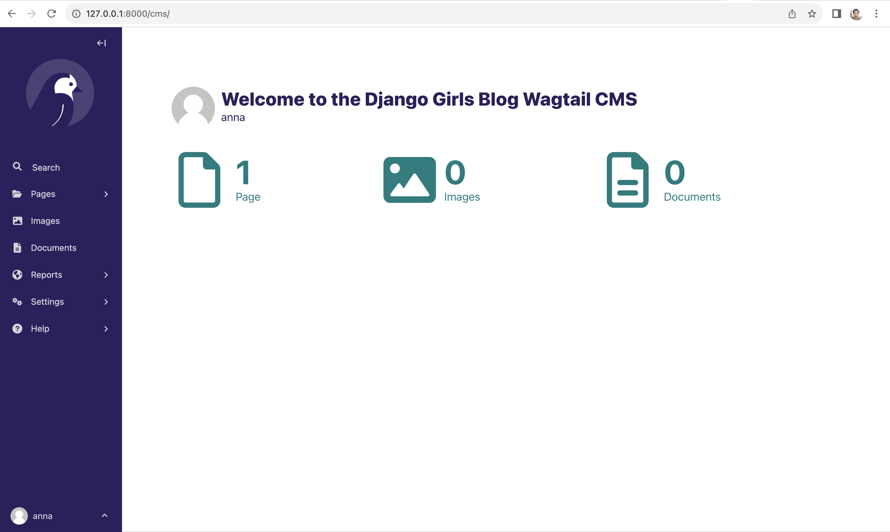
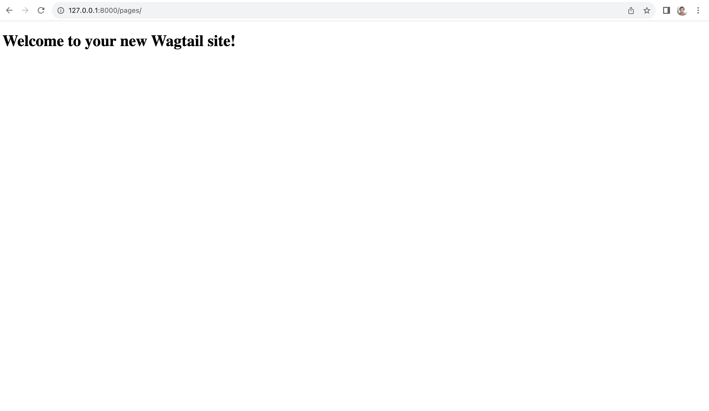
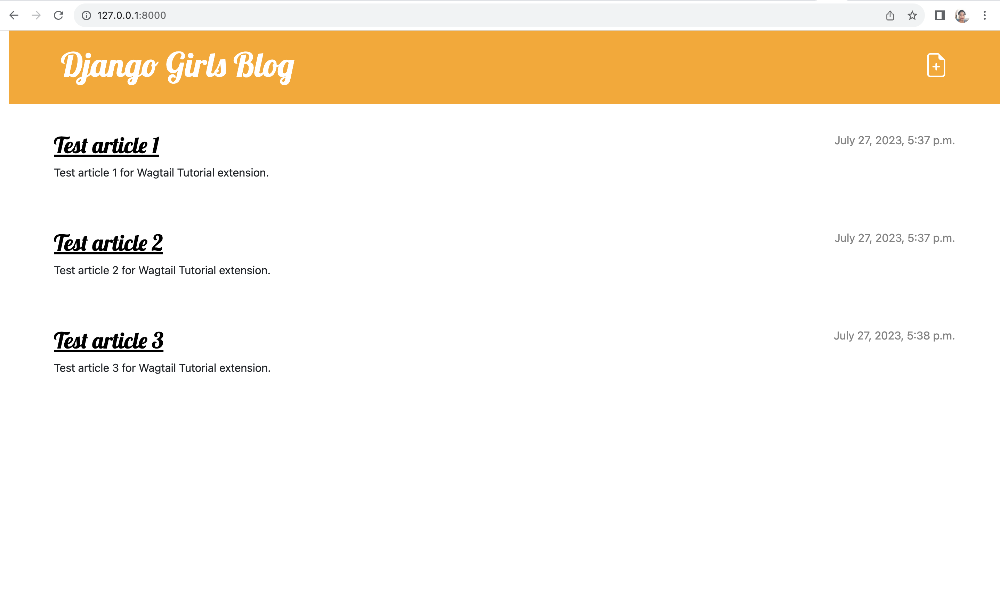
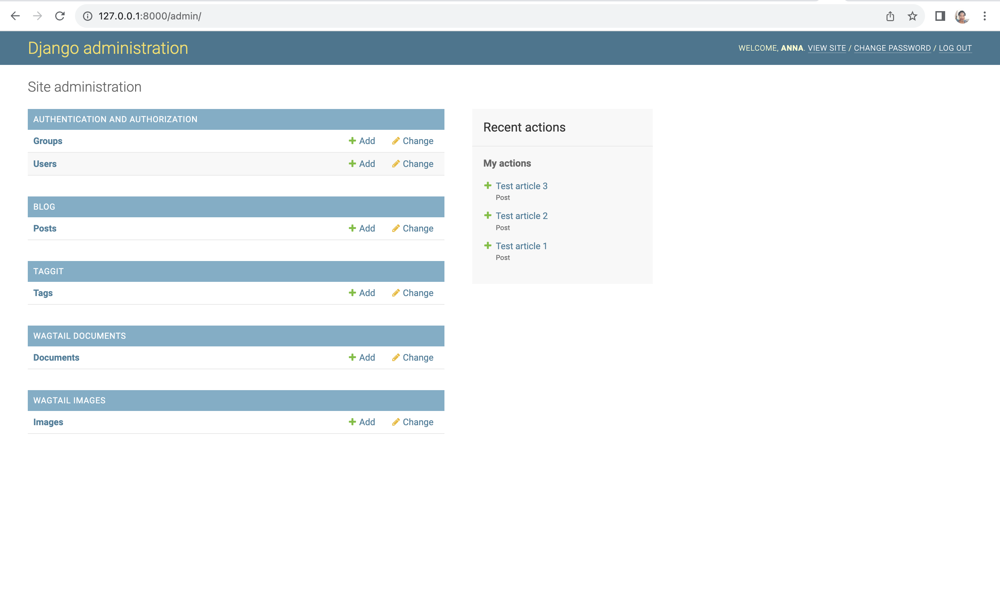

# Wagtail Installation and Configuration

In this section, we will cover how to install and configure Wagtail in an already existing project. The experience will
slightly be different from just launching a new Wagtail project as we already have a working project that we need to 
improve by adding the powerful and wonderful capabilities of Wagtail.

## Wagtail Installation
To install Wagtail, type the following command in the command prompt:

```
(myvenv) ~/djangogirls$ pip install wagtail>=5.2,<5.3
```

Now that we have installed Wagtail, we need to add it to our `requirements.txt` so that we can keep track of our 
requirements and we can easily install all our project dependencies when we deploy the changes to our website. To 
update the `requirements.txt`, type the following command in the command prompt:

```
(myvenv) ~/djangogirls$ pip freeze > requirements.txt
```

## Wagtail Settings
Now, we should update the Wagtail configuration in `mysite/settings.py`. First, add Wagtail and its associated apps to `INSTALLED_APPS`, like this:

```python
INSTALLED_APPS = [
    "django.contrib.admin",
    "django.contrib.auth",
    "django.contrib.contenttypes",
    "django.contrib.sessions",
    "django.contrib.messages",
    "django.contrib.staticfiles",
    "wagtail.contrib.forms",
    "wagtail.contrib.redirects",
    "wagtail.embeds",
    "wagtail.sites",
    "wagtail.users",
    "wagtail.snippets",
    "wagtail.documents",
    "wagtail.images",
    "wagtail.search",
    "wagtail.admin",
    "wagtail",
    "modelcluster",
    "taggit",
    "blog",
]
```

So far we have only been using Django's inbuilt middleware. However to use Wagtail, we need to add its custom middleware.
We need to add the following line to the `MIDDLEWARE` setting:

```python
    "wagtail.contrib.redirects.middleware.RedirectMiddleware",
```

The `MIDDLEWARE` setting should now look like this:

```python
MIDDLEWARE = [
    "django.middleware.security.SecurityMiddleware",
    "django.contrib.sessions.middleware.SessionMiddleware",
    "django.middleware.common.CommonMiddleware",
    "django.middleware.csrf.CsrfViewMiddleware",
    "django.contrib.auth.middleware.AuthenticationMiddleware",
    "django.contrib.messages.middleware.MessageMiddleware",
    "django.middleware.clickjacking.XFrameOptionsMiddleware",
    "wagtail.contrib.redirects.middleware.RedirectMiddleware",
]
```

We also need the `MEDIA_ROOT` and `MEDIA_URL` settings as shown below:

```python
MEDIA_ROOT = BASE_DIR / 'media'
MEDIA_URL = '/media/'
```

The last setting to be added is the `WAGTAIL_SITE_NAME`. This will be displayed on the main dashboard of the 
Wagtail admin backend. This should look like below:

```python
WAGTAIL_SITE_NAME = 'Django Girls Blog'
```

## URL Configuration
We also need to add Wagtail URLs to our root URLs file, that is `mysite/urls.py` so that we are able to access Wagtail 
views. We will add the following lines to `mysite/urls.py` right below the imports we have. The Wagtail imports should 
be below the Django imports so that we follow best practices for handling imports. This is because Wagtail imports are 
**third party** imports so should be below the main Django imports.

```python
from wagtail.admin import urls as wagtailadmin_urls
from wagtail import urls as wagtail_urls
```

Then we need to add the following lines to `urlspatterns` list to include Wagtail URLs.
```python
    path('cms/', include(wagtailadmin_urls)),
    path('pages/', include(wagtail_urls)),
```

Wagtail comes with its own custom admin interface provide by `wagtailadmin_urls` which we will be able to access by 
visiting the URL`/cms/`. This is different from the Django admin interface provided by `django.contrib.admin`we have 
been accessing by the `/admin/` URL. In a typical Wagtail only project, the admin site would be at `/admin/` but 
because we are adding Wagtail to an already existing Django project, this would clash with our , admin URL so we are 
using `/cms/` to access the Wagtail admin interface and keep using `/admin/` to access the Django admin interface.

Wagtail also comes with a user interface for serving Wagtail pages which is provided for by `wagtail_urls` and can be 
accessed by visiting the `/pages/` URL. In our current setup, Wagtail will handle Wagtail URLs under `/pages/` and leave
our the root and admin URLs to be handled by our normal Django project. Alternatively, we can have Wagtail serve all 
URLs, which we will work towards in this project, but for now, we will leave things as they are.

Wagtail also has `wagtail.documents` to be used for documents management which we could also import as 
`wagtaildocs_urls`. However, since we will not be managing any documents for now, we can skip that and just add the two
Wagtail URLs.

We also need to add the media URLs to our `mysite/urls.py` to enable us to serve user uploaded files by adding the 
following lines to the top of the file:

```python
from django.conf import settings
from django.conf.urls.static import static
```
and then add the line below to the end of the file, right after the closing brace for `urlpatterns` to add it to the 
list of URLs:

```python
+ static(settings.MEDIA_URL, document_root=settings.MEDIA_ROOT)
```

Our `mysite/urls.py` should now look like below:

mysite/urls.py
```python
from django.conf import settings
from django.conf.urls.static import static
from django.contrib import admin
from django.urls import include, path

from wagtail.admin import urls as wagtailadmin_urls
from wagtail import urls as wagtail_urls

urlpatterns = [
    path("admin/", admin.site.urls),
    path('', include('blog.urls')),
    path('cms/', include(wagtailadmin_urls)),
    path('pages/', include(wagtail_urls)),
] + static(settings.MEDIA_URL, document_root=settings.MEDIA_ROOT)
```

After this, we need to run migrations to create models for Wagtail as shown below:

```
(myvenv) ~/djangogirls$ python manage.py runserver
```

We should now be able to get the following when we visit `http://127.0.0.1:8000/cms/`:




We should also get the following when we visit `http://127.0.0.1:8000/pages/`:




Our existing root URL for the blog at `http://127.0.0.1:8000` should also still be working




as well as our Django admin interface at `http://127.0.0.1:8000/admin/`.




Looks like we are all set to use Wagtail in our project. We are ready to move to the next stage where will integrate our
blog to use Wagtail.

Let's keep going!