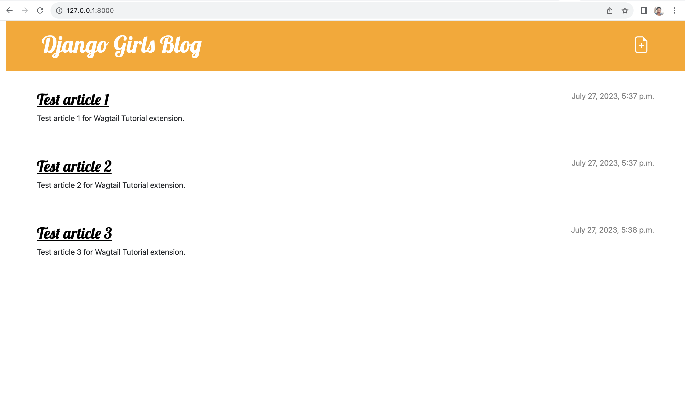
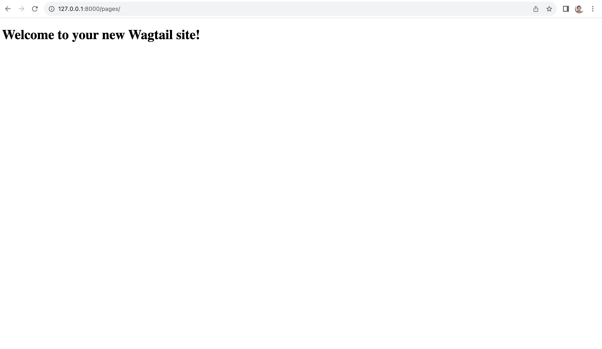
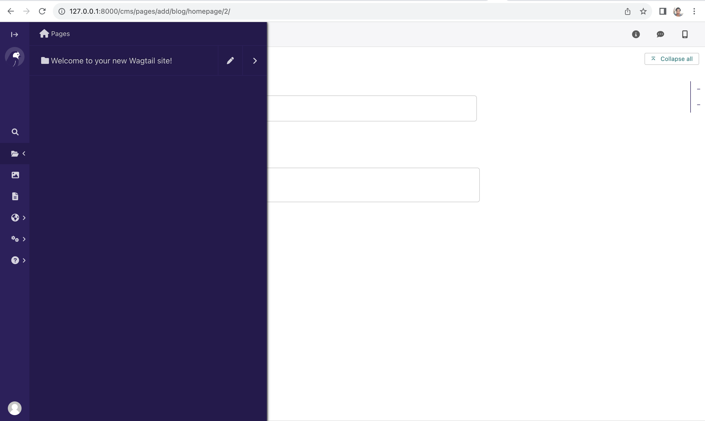
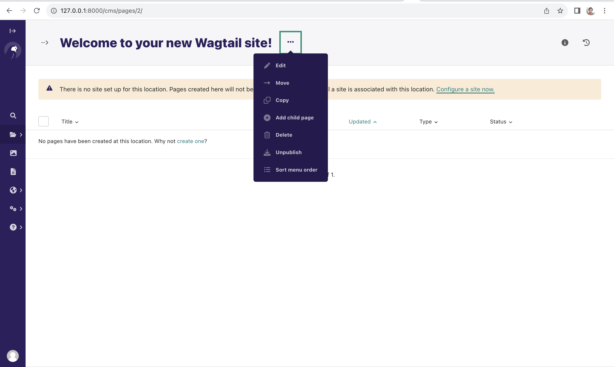
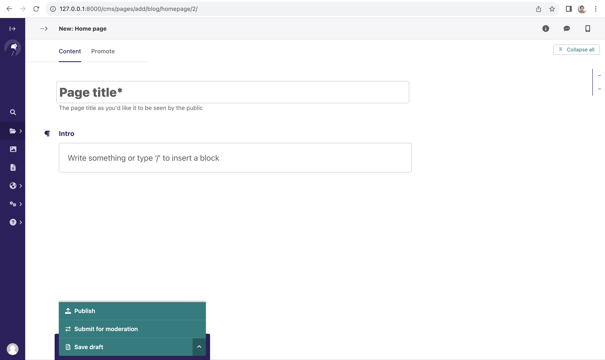
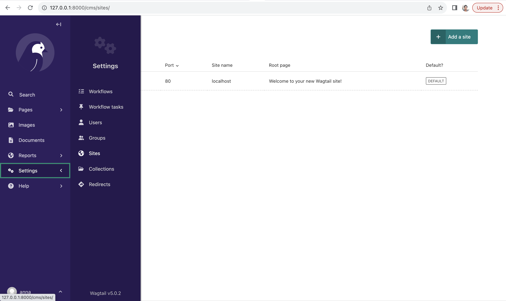
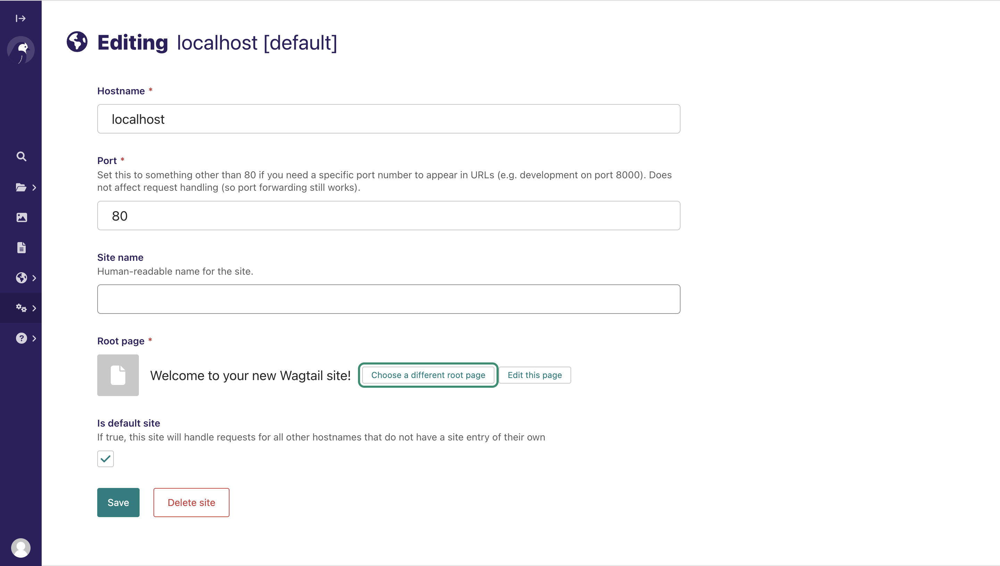
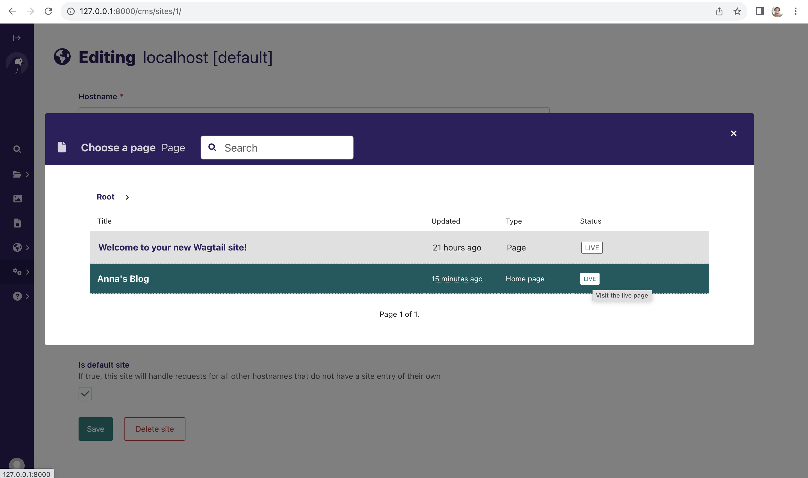
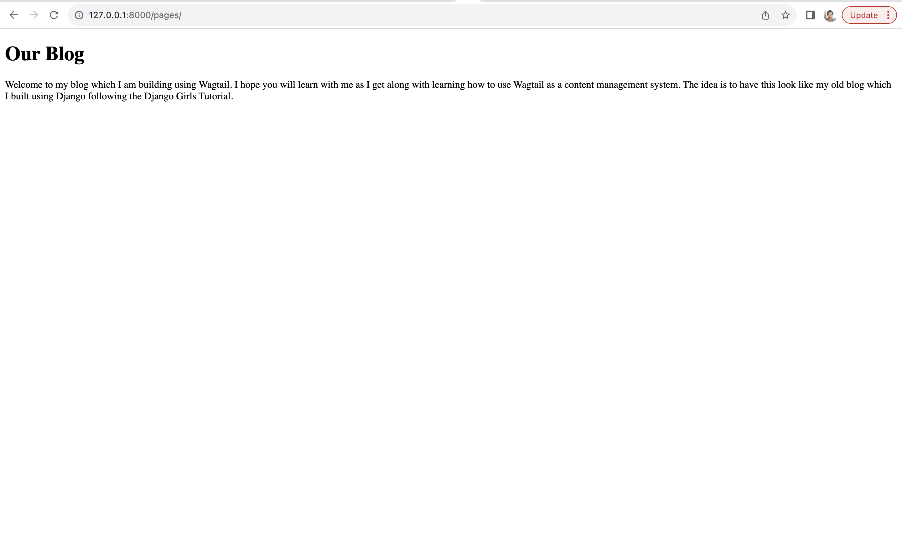
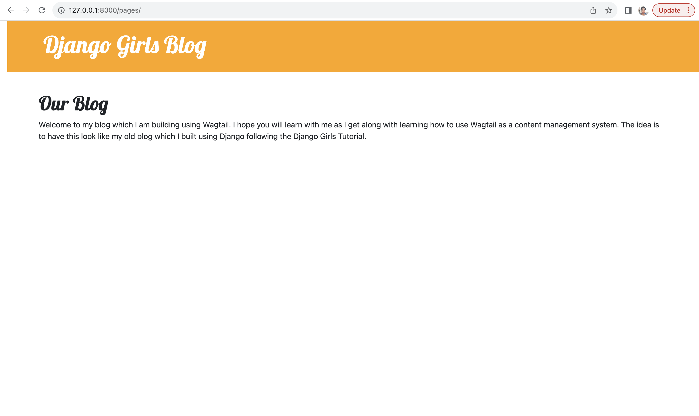

# Adding the Homepage

Now that we have Wagtail installed, up and running, we now need to work towards serving our blog through Wagtail. 
We already have developed a blog that we are serving using Django that we need to migrate to use Wagtail and this will 
involve some changes to our models and HTML files so that we use Wagtail to manage our blog.

To start off, we have a blog homepage that looks like below:



and Wagtail homepage that looks like below:



We need to refactor our code and make changes to it so that our Wagtail homepage looks like our blog homepage. 
We also want to end up with the blog using Wagtail instead of the views and URLs we already have.

Let's get started!


## Creating the Wagtail blog homepage
For now our `blog/models.py` looks like below:

 blog/models.py 
```python
from django.conf import settings
from django.db import models
from django.utils import timezone


class Post(models.Model):
    author = models.ForeignKey(settings.AUTH_USER_MODEL, on_delete=models.CASCADE)
    title = models.CharField(max_length=200)
    text = models.TextField()
    created_date = models.DateTimeField(default=timezone.now)
    published_date = models.DateTimeField(blank=True, null=True)

    def publish(self):
        self.published_date = timezone.now()
        self.save()

    def __str__(self):
        return self.title
```

We first need to add a model to define the homepage for our Wagtail site that extends the Wagtail model `Page`. We will
start by making the following imports:

```python
from wagtail.models import Page
from wagtail.fields import RichTextField
from wagtail.admin.panels import FieldPanel
```

Next we need to define the `HomePage` model to `blog/models.py`. This will serve our Wagtail blog home page. 
 We will add the following lines to it.

```python
class HomePage(Page):
    intro = RichTextField(blank=True)

    content_panels = Page.content_panels + [
        FieldPanel('intro')
    ]
```

We can now run the following command to make the migrations for `HomePage`

```bash
(myvenv) ~/djangogirls$ python3 manage.py makemigrations 
``` 

and the migrate command to create the `HomePage` model as shown below:

```bash
(myvenv) ~/djangogirls$ python3 manage.py migrate
```

Django experts an HTML template that matches the model name, so in this case, the template should be 
`home_page.html` unless we override it, which we will not do for now. We therefore need to create the template in 
the `blog/templates/blog/home_page.html`.

Create a new HTML file in `blog/templates/blog` and name it `home_page.html`. Create another HTML file in 
`blog/templates/blog` and name it `wagtail_base.html`. 

In your `blog/templates/blog/wagtail_base.html`, write the following code:

 wagtail_base.html 
```html
<!DOCTYPE html>
<html lang="en">
<head>
    <meta charset="UTF-8">
    <title>Our Wagtail Blog</title>
</head>
<body>
    <div>
        

        
    </div>
</body>
</html>
```

In your `blog/templates/blog/home_page.html`, write the following code:

 home_page.html 
```html




template-blogindexpage


    <h1>{{ page.title }}</h1>

    <div class="intro">{{ page.intro|richtext }}</div>

    
        <article class="post">
            <time class="date">
                {{ post.first_published_at }}
            </time>
            <h2><a href="">{{ post.title }}</a></h2>
            {{ post.specific.intro }}
            {{ post.specific.body|richtext }}
        </article>
    

```

Let's explain a few new terms. The `pageurl` tag, is similar to Django’s `url` tag but takes a Wagtail Page object as 
an argument. The `get_children` method gets a queryset of all the children of the homepage. This way we are able to
display them on the homepage. For now, our blog doesn't have any children so no posts will be displayed on the homepage.

## Changing the Wagtail Homepage {#changing-homepage}
Now that we have created our homepage model and created the templates, we are ready to change our homepage from the 
default provided by Wagtail and use our newly created homepage. 

Let's visit `http://127.0.0.1:8000/cms/` to access our Wagtail admin. 

From here, click on `Pages` and click on the pen icon to edit the only page that is there, the 
`Welcome to your new Wagtail site!`. 



Once you open this page, click on the menu icon and select `Add Child Page` and select the newly created `Home page`.



Enter the title and content and then click `Publish` to save the content and publish the page. Notice how we do not have
a `publish()` method in our model because the Wagtail base class `Page` model which we inherit from already takes care 
of that for us and we do not need to do extra work to ensure we can publish posts while saving the timestamp for when 
the post was published.




After this, you need to edit the site to point to the newly created page by making the new homepage the root page for 
the site. To do this, you need to click on  `Settings` then `Sites`, and click the default site, `localhost` that 
already exists to edit it.



Keep all other values the same and click on `Root page` to change the root page.



Select the child page you just added as the new root page. 



Click `Save` to update and if you refresh `http://127.0.0.1:8000/pages/` you should now see the new homepage.



Now that we have changed the homepage of our Wagtail blog, let's update the layout to match the blog we developed 
previously following the main tutorial.


## Adding CSS Styling to the Wagtail Site
We need to add Bootstrap styling as well as our own style we already wrote to `blog/templates/blog/layout.html`. We 
will copy the lines below from `blog/templates/blog/base.html` to add CSS styling to our new blog.

```html

<link rel="stylesheet" href="https://cdn.jsdelivr.net/npm/bootstrap@5.1.3/dist/css/bootstrap.min.css"
      integrity="sha384-1BmE4kWBq78iYhFldvKuhfTAU6auU8tT94WrHftjDbrCEXSU1oBoqyl2QvZ6jIW3" crossorigin="anonymous">
<link href="//fonts.googleapis.com/css?family=Lobster&subset=latin,latin-ext" rel="stylesheet" type="text/css">
<link rel="stylesheet" href="">
```

We will also add the page header to the page by adding the lines of code below to our `wagtail_base.html`.

```html
<header class="page-header">
    <div class="container">
        <h1><a href="/">Django Girls Blog</a></h1>
    </div>
</header>
```

Let's also add the CSS class `container` to our `div` for the content as shown below:

```html
<div class="container">
    

    
</div>
```

Our layout file should now look like below:

 wagtail_base.html 
```html
<!DOCTYPE html>
<html lang="en">
<head>
    <meta charset="UTF-8">
    <title>Anna's Wagtail Blog</title>
    
    <link rel="stylesheet" href="https://cdn.jsdelivr.net/npm/bootstrap@5.1.3/dist/css/bootstrap.min.css"
          integrity="sha384-1BmE4kWBq78iYhFldvKuhfTAU6auU8tT94WrHftjDbrCEXSU1oBoqyl2QvZ6jIW3" crossorigin="anonymous">
    <link href="//fonts.googleapis.com/css?family=Lobster&subset=latin,latin-ext" rel="stylesheet" type="text/css">
    <link rel="stylesheet" href="">
</head>
<body>
    <header class="page-header">
        <div class="container">
            <h1><a href="/">Django Girls Blog</a></h1>
        </div>
    </header>
    <div class="container">
        

        
    </div>
</body>
</html>
```

Let's refresh and see our progress so far. 



Yay! Our Wagtail blog looks like the blog we developed earlier on. However, we are not displaying our posts like we did 
in the blog we developed earlier. We will look at this in the next chapter.

See you there!