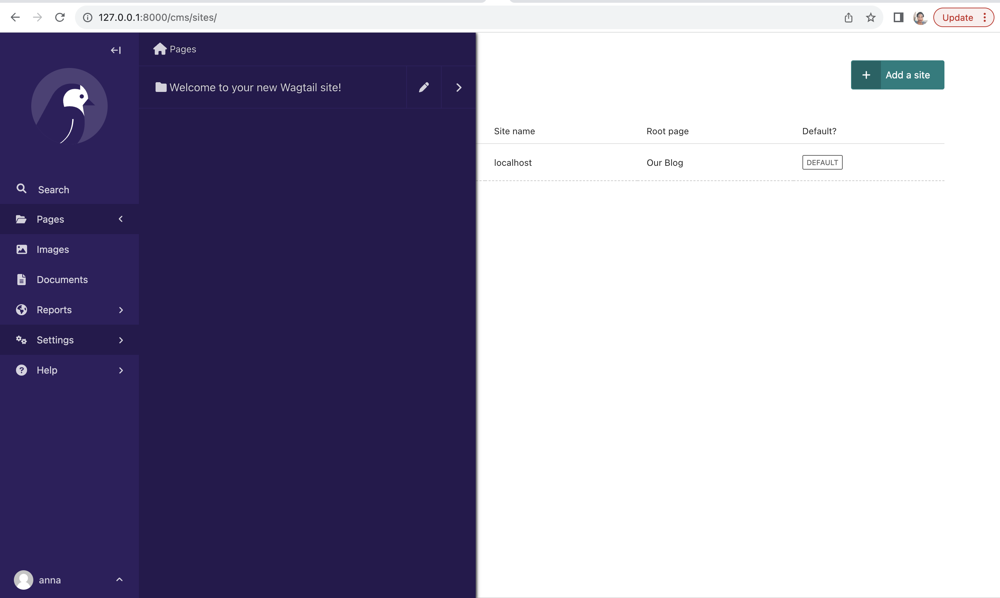
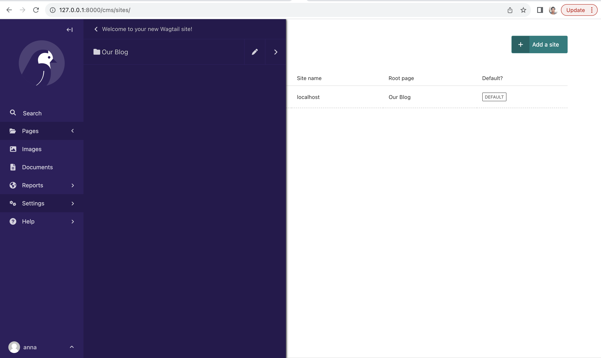
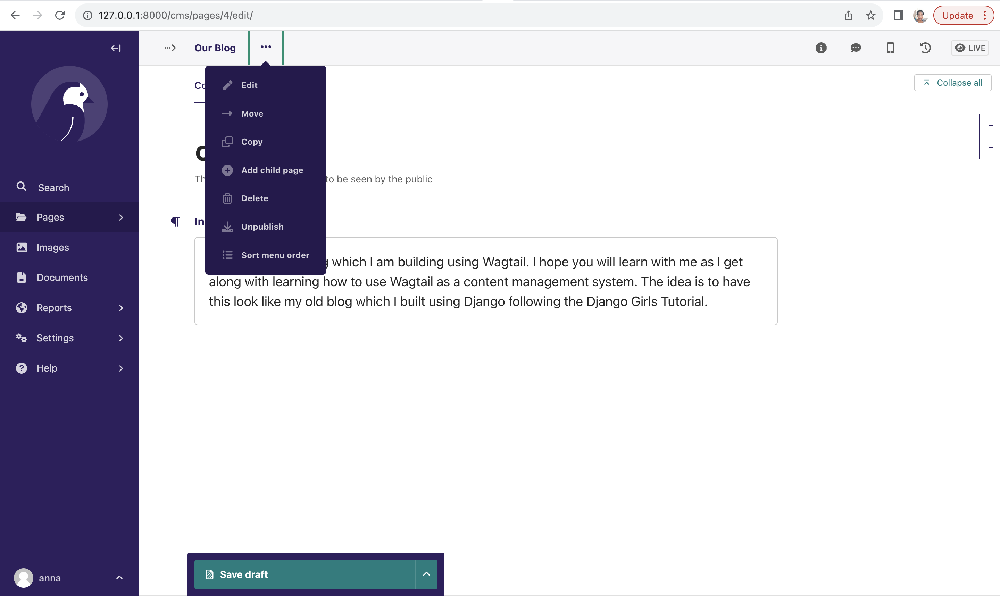
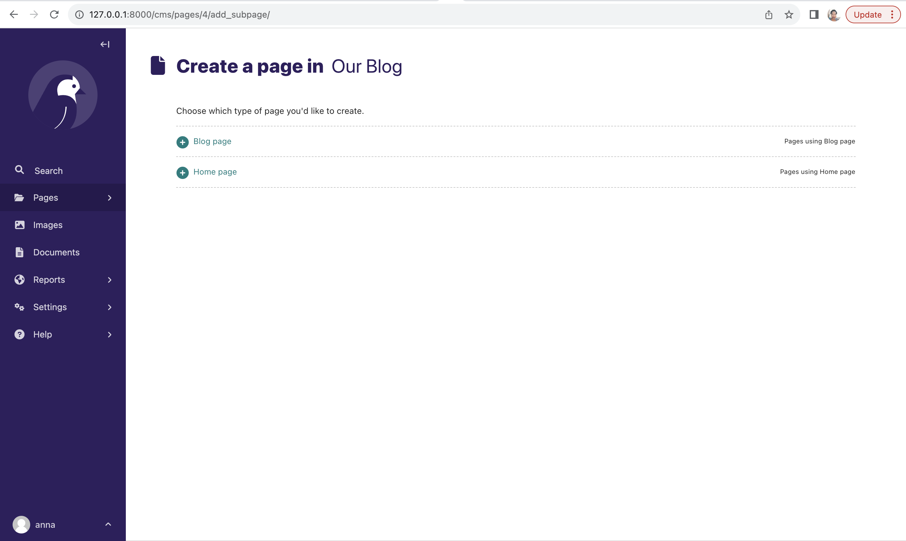
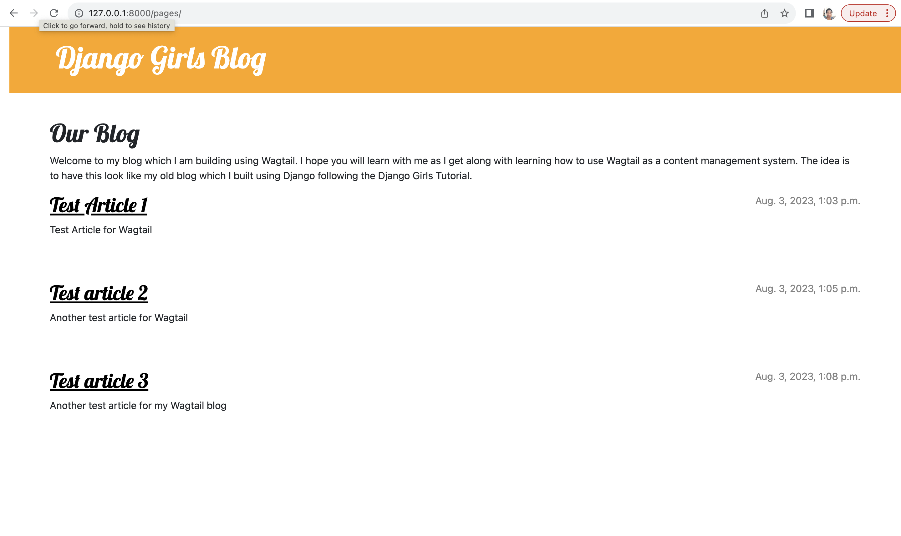

# Adding Posts to Wagtail

> Part of this tutorial is based on the Wagtail Tutorial by TorchBox  
> (https://docs.wagtail.org/en/stable/getting_started/tutorial.html#).

In the last section, we created a new page model which we used to add content to our homepage called `Homepage`, changed 
the root of our Wagtail site to use this new homepage. We also added the CSS styling we were already using in our 
project and now the Wagtail has the same look and feel as our website, which is really pretty amazing!

Now, we need to use our posts model to render the posts we already have on the blog using Wagtail. 

Let's get started!

## Adding BlogPage model to Wagtail for posts
We already have a `Post` model in our `models.py` that inherits from `django.db.models.Model`. We will leave it as it is
for now and add a new model, a child model of `HomePage` which we will name `BlogPage`. Like the `HomePage` model, our 
new models also inherits from `wagtails.models.Page` like its parent model `HomePage`.

We first need to add the following import to our `models.py`:

```python
from wagtail.search import index
```

Next we need to add the `BlogPage` model to as shown below:

```python
class BlogPage(Page):
    date = models.DateField("Post date")
    intro = models.CharField(max_length=250)
    text = RichTextField(blank=True)

    search_fields = Page.search_fields + [
        index.SearchField('intro'),
        index.SearchField('text'),
    ]

    content_panels = Page.content_panels + [
        FieldPanel('date'),
        FieldPanel('intro'),
        FieldPanel('text'),
    ]
```

Before we move on, we will make some comparisons between our `Post` and `BlogPage` models. 
- Our `Post` model contains a field named but we can't use the same field name in our `BlogPage` model because our base 
model `Page` already contains a field by that name and hence this will cause an error. 
- Our `Post` model also has fields`author` and `published_date` which we omitted in our `BlogPage` model because our 
base model `Page` has a field `owner`that represents the `author` and has a `-first_published_at` field that represents 
the `published_date`. 
- We also do not have the `publish` method as this is again handled by a method in our `Page` model. 
- The `Page` class also takes care of the string representation for our `BlogPage` model hence we do not have to define 
a `__str__()` method in the model as we already inherited that. 
- Wagtail also takes care of the search functionality for our `BlogPage` model. For this we only need to define 
`search_fields`, something we would need to do in `admin.py` for our `Post` model. We imported `index` in `BlogPage` 
because it makes our model searchable and then we listed the fields we wanted to use for searching the model.

As you can see, Wagtail takes care of most of the work we would have done for ourselves by writing our own code to 
have that functionality. Among Wagtail's many powerful capabilities is the search capability for which Wagtail provides 
two backends for storing the search index and performing search queries: one using the database's full-text search 
capabilities, and another using Elasticsearch. You can also roll your own search backend. Isn't that awesome?

We can now run `python3 manage.py makemigrations`command to make migrations for `BlogPage`

```bash
(myvenv) ~/djangogirls$ python3 manage.py makemigrations 
``` 

and the migrate command to create the `BlogPage` model as shown below:

```bash
(myvenv) ~/djangogirls$ python3 manage.py migrate
```

Now that we have created our `BlogPage` model, we need to add a template `blog_page.html` in our `blog/templates/blog` 
folder and add the following:

 blog_page.html 
```html




template-blogpage


    <h1>{{ page.title }}</h1>
    <p class="meta">{{ page.date }}</p>

    <div class="intro">{{ page.intro }}</div>

    {{ page.body|richtext }}

    <p><a href="{{ page.get_parent.url }}">Return to blog</a></p>


```

Wagtail’s built-in `get_parent()` method  is used to obtain the URL of the blog this post is a part of.

Now we can create a few blog posts as children of `Home Page`. To do this, navigate to `Pages` and click on the arrow
to go to the new homepage you just created. 



Click on the edit icon for the homepage you just created, in our case the homepage is called `Our Blog` as shown below.



Click on the three dots and select `Add Child Page` as shown below.



This will show the types of pages available as shown below. 



Be sure to select type  `Blog Page` when creating your posts. Add any content you like and create at least three posts.
Also make sure the blog pages have slugs on the Promote tab, or Wagtail will automatically generate the slug for you. 
Be sure to click `Publish` to publish the posts. 

If you access http://127.0.0.1:8000/pages/ on your site, you will see that the text for your homepage is rendering as
well as posts from your blog posts. You should have something similar to what's shown below:



With that working, we are ready to move to the final part of this tutorial and make the Wagtail blog the homepage for 
our website. 

Let's do this in the next section!