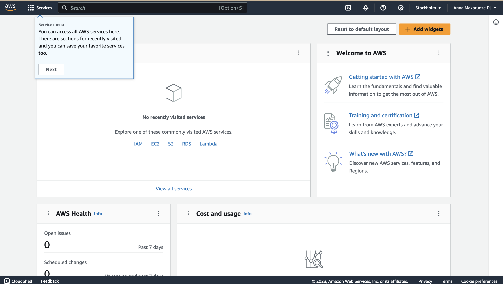
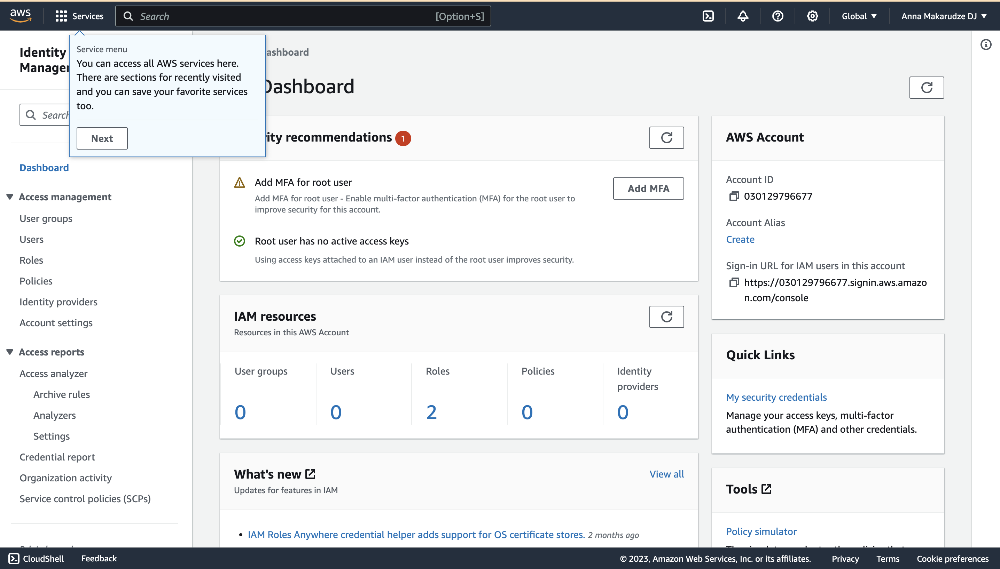

# Getting Started with AWS

Let's get started exploring the AWS platform.

There are several ways of accessing or managing AWS resource. One way you can access AWS is through the web interface 
popularly known as the AWS Management Console. You can also access and manage AWS through what is commonly known as 
programmatic access which is through the AWS Command Line Interface (AWS CLI) or using an AWS Software Development Kit 
(AWS SDK) using code. 

AWS CLI is a unified tool used to manage your AWS services. With AWS CLI, you can control AWS services from the command 
line on your local machine and automate the management of AWS services using scripts. AWS SDK is a set of platform-specific
tools for developers to manage AWS services using their code. Since our website was developed using Python and Django, 
we will a Python SDK `boto` with AWS Elastic Beanstalk when we deploy our website.

To access the Management Console, login in to AWS using the email and password you used when you were setting your AWS account. 
This account is known as the root account. For security reasons, it is not encouraged for you to use your root account for 
normal day-to-day operations. This is because your root account has system-wide access and you can delete your resources by
mistake. Furthermore, if your credentials get into the wrong hands they may intentionally cause harm to your account and resources.

For this reason, it is recommended that you add an extra layer of security to your account. The most common way is to add
Multi Factor Authentication (MFA) which you can easily do using an authenticator app such as Google Authenticator,
Microsoft Authenticator App or Authy. We will not explore how to set up MFA in this tutorial.

After setting up MFA, you can go ahead and create an IAM user that you will use to login to the Management Console as well for
programmatic access using AWS CLI. We will also need to install AWS CLI on our local machine. We will cover how to set up these below.

# Accessing the AWS Management Console
To use the Management Console, [click this link](https://aws.amazon.com/console/) and select Log in to sign in to your AWS account.
After logging in, you chould have a screen that looks like below, although the interface might change over time.



After logging in you can navigate to the IAM Dashboard to create a new user for your account that will be used for programmatic 
access to your account. However, before creating a new user, we will learn how to create a new user group that will be assigned 
permissions we want our new user to have.

# Creating a new user group in IAM
To create a new user group, click on `IAM` to access the IAM Dashboard which looks like below:



From there follow the following steps to create a new user group:
1. Click on `User groups` in the left sidebar menu.
2. Click  `Create group` button.
3. Enter the name of the user group in the textbox, let's name it `admin`.
4. Scroll down the page to `Attach Permissions` and select `AdministratorAccess` to give users in this group admin access to your account.
5. Click `Create group` button to create the group.

With this you should have a new group created in the `User groups` dashboard.

# Creating a new IAM user
Next step is to create a new IAM user for your account. To create the new user follow the steps below:
1. In the left sidebar menu, click on `Users`.
2. Click on `Create user` button.
3. Enter the username in the textbox, like your name, for example, I would use `anna`.
4. Next, select the `Provide user access to the AWS Management Console - optional` checkbox to give your new user access.
5. Choose the `User type` where there is a question `Are you providing console access to a person?` choose 
`I want to create an IAM user`.
6. Since this is your own account, for the `Console password` part, choose `Custom password` so you can enter your password. 
The `Autogenerated password` is useful if you are creating an acoount for someone else. In this case, you would need to 
make sure the `User must create a new password at next sign-in - Recommended` and you would need to email them the password.
For our use case, we deselect this since we already chose a custom password for our new account, hence there is no need to 
change it at next sign-in.
7. Click `Next` to proceed to the next stage. 
8. Next, choose `Add user to a group` and select the `admin` group we created previously to give the user `AdministrativeAccess` 
to your account.
9. Click `Next` to continue to the next step.
10. Review the information you entered for the new `IAM user` and if all is well click `Create user` button to create the user.

After the process completes, the new user will appear in the `Users` dashboard. 
With the new user created, you are now ready to create the access key for this user to use with AWS CLI and AWS Elastic Beanstalk CLI 
we will use for deploying our website.

Let's proceed to the next stage and create the access keys for our new users.

# Create AWS access key credentials
Access keys enables the user to connect to the AWS APIs from the command line just the same way the user would access the 
management console using email address and password. 
This means that access credentials are secret, cannot be shared and need to stored securely to prevent malicious users from accessing your 
account.

While still on the `Users` dashboard, follow the steps below to create access key credentials for the newly created user:
1. Click the new IAM user you just created.
2. Click on the `Access key` link.
3. For the `Use Case` select `Command Line Interface (CLI)`. A recommendation will shortly appear. Click 
`I understand the above recommendation and want to proceed to create am access key` and click `Next` button.
4. The access key will be created. After it is created, click `Download .csv file` to download the credentials you have 
just created. The file name will be named as `<username>_accessKeys.csv`, for example, in my case `anna_accessKeys.csv`. 
5. Click `Done` to complete the process.

After creating access keys, the next step will be install AWS CLI so we can configure the access keys locally and gain
programmatic access to our AWS account through command line.


# Installing AWS CLI
To install AWS CLI, follow the instructions for your operating system.

> If you encounter challenges with the installation, you can refer to the 
  [AWS CLI documentation](https://docs.aws.amazon.com/cli/latest/userguide/getting-started-install.html) for more
  information on how to troubleshoot AWS CLI for your distribution or operating system.

<!-- sec data-title="Installing AWS CLI on Linux" data-id="aws-cli-linux" data-collapse=true ces-->

<!--endsec-->

<!-- sec data-title="Installing AWS CLI on Mac OSX" data-id="aws-cli-macosx" data-collapse=true ces-->

<!--endsec-->

<!-- sec data-title="Installing AWS CLI on Windows" data-id="aws-cli-windows" data-collapse=true ces-->

<!--endsec-->


# Configuring AWS CLI
Open the `.csv` file you downloaded earlier on to get your AWS credentials as you will need them to configure AWS CLI.
In your terminal or command line window, type the `aws configure` command and enter the details in the `.csv` file.
Remember to set your default region and output format as shown below.

```
$ aws configure
AWS Access Key ID [****************XXXX]: EEDHUF3H8R3R3KJF0
AWS Secret Access Key [None]: RFMR3LKPFR[RJPOR3-34-4U4BRFLdneieio]
Default region name [None]: eu-north-1
Default output format [None]: json
```

With that, we have set up AWS CLI and we are ready to go to the next stage of our tutorial where we deploy our 
website to AWS using AWS Elastic Beanstalk.

Let's continue!