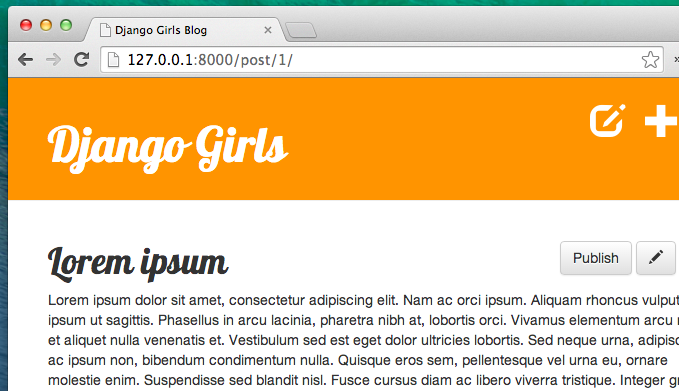

# Homework: add more to your website!

Our blog has come a long way but there's still room for improvement. Next, we will add features for post drafts and their publication. We will also add deletion of posts that we no longer want. Neat!

## Save new posts as drafts

Currently when we're creating new posts using our *New post* form the post is published directly. To instead save the post as a draft, **remove** this line in `blog/views.py` in the `post_new` and `post_edit` methods:

```python
post.published_date = timezone.now()
```

This way, new posts will be saved as drafts that we can review later on rather than being instantly published. All we need now is a way to list and publish drafts, let's get to it!

## Page with list of unpublished posts

Remember the chapter about querysets? We created a view `post_list` that displays only published blog posts (those with non-empty `published_date`).

Time to do something similar, but for draft posts.

Let's add a link in the `<div class="page-header">` section of `blog/templates/blog/base.html`. We don't want to show our list of drafts to everybody, so we'll put it inside the `` check, right after the button for adding new posts.

```django
<a href="" class="top-menu">Drafts</span></a>
```

Next: urls! In `blog/urls.py` we add:

```python
path('drafts/', views.post_draft_list, name='post_draft_list'),
```

Time to create a view in `blog/views.py`:

```python
def post_draft_list(request):
    posts = Post.objects.filter(published_date__isnull=True).order_by('created_date')
    return render(request, 'blog/post_draft_list.html', {'posts': posts})
```

The line `    posts = Post.objects.filter(published_date__isnull=True).order_by('created_date')` makes sure that we take only unpublished posts (`published_date__isnull=True`) and order them by `created_date` (`order_by('created_date')`).

Ok, the last bit is of course a template! Create a file `blog/templates/blog/post_draft_list.html` and add the following:

```django



    
        <div class="post">
            <p class="date">created: {{ post.created_date|date:'d-m-Y' }}</p>
            <h1><a href="">{{ post.title }}</a></h1>
            <p>{{ post.text|truncatechars:200 }}</p>
        </div>
    

```

It looks very similar to our `post_list.html`, right?

Now when you go to `http://127.0.0.1:8000/drafts/` you will see the list of unpublished posts.

Yay! Your first task is done!

## Add publish button

It would be nice to have a button on the blog post detail page that will immediately publish the post, right?

Let's open `blog/templates/blog/post_detail.html` and change these lines:

```django

    <div class="date">
        {{ post.published_date }}
    </div>

```

into these:

```django

    <div class="date">
        {{ post.published_date }}
    </div>

    <form method="POST" action="" class="post-form">
        <button type="submit" class="post btn btn-secondary" name="publish">Publish</button>
    </form>

```

As you noticed, we added `` line here. That means, that if the condition from `` is not fulfilled (so if there is no `published_date`), then we want to do the lines with `<form ... </form>`. But wait -- why are we bothering with a form here? There are no fields to fill in. Why are we not creating the publish button using an `<a class="btn">` element like we did before?

So far, we have glossed over the difference between user actions which only retrieve data to show (like listing the posts), on one hand, and actions which change the data (like creating a new post) on the other hand. It is useful for all kinds of software running on the web (including your web browser) to be able to tell the difference between the two, before sending the relevant requests. To facilitate this, the web standards define GET requests as retrieval-only operations, and POST requests as potentially-data-changing operations.

As you may have noticed, when a user clicks an `<a>` element, the browser sends out a GET request. So these elements are not suitable for data-changing operations. Since publishing the blog-post changes the data on the server, an `<a>` element is not suitable here. In order to generate a POST request, we need to create a form.

Now, let's take a look at the details of the form. We are using a new attribute, `action`, to specify that the form is submitted to a URL that is different from the one on which it is presented. As before, we are using a `` template-tag, and are passing a `pk` variable to it. The rest is as it was with the edit form -- the `` for security, and the submit button.

Time to create a URL (in `blog/urls.py`):

```python
path('post/<int:pk>/publish/', views.post_publish, name='post_publish'),
```

and finally, a *view* (as always, in `blog/views.py`):

```python
def post_publish(request, pk):
    post = get_object_or_404(Post, pk=pk)
    if request.method=='POST':
        post.publish()
    return redirect('post_detail', pk=pk)
```

Note that we check the request method before executing the operation -- although the pages we will emit will not include a direct link to the URL of this view, and so one could think this check is redundant, in practice this sort of "defensive programming" often pays off, preventing damage which could have been caused by bugs.

Remember, when we created a `Post` model we wrote a method `publish`. It looked like this:

```python
def publish(self):
    self.published_date = timezone.now()
    self.save()
```

Now we can finally use this!

And once again after publishing the post we are immediately redirected to the `post_detail` page!



Congratulations! You are almost there. The last step is adding a delete button!

## Delete post

Let's open `blog/templates/blog/post_detail.html` once again and add these lines:

```django
<form method="POST" action="" class="post-form">
    <button type="submit" class="post btn btn-danger" name="delete">
    Delete
    </button>
</form>
```

just under a line with the edit button.

Now we need a URL (`blog/urls.py`):

```python
path('post/<int:pk>/remove/', views.post_remove, name='post_remove'),
```

Now, time for a view! Open `blog/views.py` and add this code:

```python
def post_remove(request, pk):
    post = get_object_or_404(Post, pk=pk)
    if request.method=='POST':
        post.delete()
    return redirect('post_list')
```

The only new thing is to actually delete a blog post. Every Django model can be deleted by `.delete()`. It is as simple as that!

And this time, after deleting a post we want to go to the webpage with a list of posts, so we are using `redirect`.

Let's test it! Go to the page with a post and try to delete it!


Yes, this is the last thing! You completed this tutorial! You are awesome!
