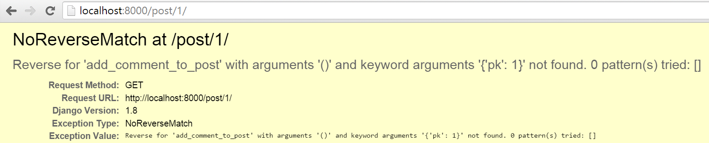
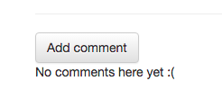

# Homework: create comment model

Currently, we only have a Post model. What about receiving some feedback from your readers and letting them comment?

## Creating comment blog model

Let's open `blog/models.py` and append this piece of code to the end of file:

blog/models.py
```python
class Comment(models.Model):
    post = models.ForeignKey('blog.Post', on_delete=models.CASCADE, related_name='comments')
    author = models.CharField(max_length=200)
    text = models.TextField()
    created_date = models.DateTimeField(default=timezone.now)
    approved_comment = models.BooleanField(default=False)

    def approve(self):
        self.approved_comment = True
        self.save()

    def __str__(self):
        return self.text
```

You can go back to the **Django models** chapter in the tutorial if you need a refresher on what each of the field types mean.

In this tutorial extension we have a new type of field:
- `models.BooleanField` - this is true/false field.

The `related_name` option in `models.ForeignKey` allows us to have access to comments from within the Post model.

## Create tables for models in your database

Now it's time to add our comment model to the database. To do this we have to tell Django that we made changes to our model. Type `python manage.py makemigrations blog` in your command line. You should see output like this:

    (myvenv) ~/djangogirls$ python manage.py makemigrations blog
    Migrations for 'blog':
      0002_comment.py:
        - Create model Comment

You can see that this command created another migration file for us in the `blog/migrations/` directory. Now we need to apply those changes by typing `python manage.py migrate blog` in the command line. The output should look like this:

```
    (myvenv) ~/djangogirls$ python manage.py migrate blog
    Operations to perform:
      Apply all migrations: blog
    Running migrations:
      Rendering model states... DONE
      Applying blog.0002_comment... OK
```

Our Comment model exists in the database now! Wouldn't it be nice if we had access to it in our admin panel?

## Register Comment model in admin panel

To register the Comment model in the admin panel, go to `blog/admin.py` and add this line:

blog/admin.py
```python
admin.site.register(Comment)
```

directly under this line:

```python
admin.site.register(Post)
```

Remember to import the Comment model at the top of the file, too, like this:

blog/admin.py
```python
from django.contrib import admin
from .models import Post, Comment

admin.site.register(Post)
admin.site.register(Comment)
```

If you type `python manage.py runserver` on the command line and go to [http://127.0.0.1:8000/admin/](http://127.0.0.1:8000/admin/) in your browser, you should have access to the list of comments, and also the capability to add and remove comments. Play around with the new comments feature!

## Make our comments visible

Go to the `post_detail.html` file and add the following lines before the `` tag:

blog/templates/blog/post_detail.html
```django
<hr>

    <div class="comment">
        <div class="date">{{ comment.created_date }}</div>
        <strong>{{ comment.author }}</strong>
        <p>{{ comment.text|linebreaks }}</p>
    </div>

    <p>No comments here yet :(</p>

```

Now we can see the comments section on pages with post details.

But it could look a little bit better, so let's add some configuration to the CSS file:

static/css/blog.css
```css
.comment {
    margin: 20px 0px 20px 20px;
}
```

We can also let visitors know about comments on the post list page. Go to the `post_list.html` file and add the line:

blog/templates/blog/post_list.html
```django
<a href="">Comments: {{ post.comments.count }}</a>
```

After that our template should look like this:

blog/templates/blog/post_list.html
```django



    
        <div class="post">
            <div class="date">
                {{ post.published_date }}
            </div>
            <h1><a href="">{{ post.title }}</a></h1>
            <p>{{ post.text|linebreaksbr }}</p>
            <a href="">Comments: {{ post.comments.count }}</a>
        </div>
    

```

## Let your readers write comments

Right now we can see comments on our blog, but we can't add them. Let's change that!

Go to `blog/forms.py` and add the following lines to the end of the file:

blog/forms.py
```python
class CommentForm(forms.ModelForm):

    class Meta:
        model = Comment
        fields = ('author', 'text',)
```

Remember to import the Comment model, changing the line:

```python
from .models import Post
```

into:

blog/forms.py
```python
from .models import Post, Comment
```

Now, go to `post_detail.html` and before the line ``, add:

blog/templates/blog/post_detail.html
```django
<a class="btn btn-default" href="">Add comment</a>
```

If you go to the post detail page you should see this error:



We know how to fix that! Go to `blog/urls.py` and add this pattern to `urlpatterns`:

blog/urls.py
```python
path('post/<int:pk>/comment/', views.add_comment_to_post, name='add_comment_to_post'),
```

Refresh the page, and we get a different error!


To fix this error, add this view:

blog/views.py
```python
def add_comment_to_post(request, pk):
    post = get_object_or_404(Post, pk=pk)
    if request.method == "POST":
        form = CommentForm(request.POST)
        if form.is_valid():
            comment = form.save(commit=False)
            comment.post = post
            comment.save()
            return redirect('post_detail', pk=post.pk)
    else:
        form = CommentForm()
    return render(request, 'blog/add_comment_to_post.html', {'form': form})
```

Remember to import `CommentForm` at the beginning of the file:

blog/views.py
```python
from .forms import PostForm, CommentForm
```


Now, on the post detail page, you should see the "Add Comment" button.



However, when you click that button, you'll see:


Like the error tells us, the template doesn't exist yet. So, let's create a new one at `add_comment_to_post.html` and add the following code:

blog/templates/blog/add_comment_to_post.html
```django



    <h1>New comment</h1>
    <form method="POST" class="post-form">
        {{ form.as_p }}
        <button type="submit" class="save btn btn-default">Send</button>
    </form>

```

Yay! Now your readers can let you know what they think of your blog posts!

## Moderating your comments

Not all of the comments should be displayed. As the blog owner, you probably want the option to approve or delete comments. Let's do something about it.

> If you haven't already, you can download all the Bootstrap icons [here](https://github.com/twbs/icons/releases/download/v1.1.0/bootstrap-icons-1.1.0.zip). Unzip the file and copy all the SVG image files into a new folder inside `blog/templates/blog/` called `icons`. That way you can access an icon like `hand-thumbs-down.svg` using the file path `blog/templates/blog/icons/hand-thumbs-down.svg`

Go to `post_detail.html` and change lines:

blog/templates/blog/post_detail.html
```django

    <div class="comment">
        <div class="date">{{ comment.created_date }}</div>
        <strong>{{ comment.author }}</strong>
        <p>{{ comment.text|linebreaks }}</p>
    </div>

    <p>No comments here yet :(</p>

```

to:

blog/templates/blog/post_detail.html
```django

    
    <div class="comment">
        <div class="date">
            {{ comment.created_date }}
            
                <a class="btn btn-default" href="">
                   
                </a>
                <a class="btn btn-default" href="">
                   
                </a>
            
        </div>
        <strong>{{ comment.author }}</strong>
        <p>{{ comment.text|linebreaks }}</p>
    </div>
    

    <p>No comments here yet :(</p>

```

You should see `NoReverseMatch`, because no URL matches the `comment_remove` and `comment_approve` patterns... yet!

To fix the error, add these URL patterns to `blog/urls.py`:

blog/urls.py
```python
path('comment/<int:pk>/approve/', views.comment_approve, name='comment_approve'),
path('comment/<int:pk>/remove/', views.comment_remove, name='comment_remove'),
```

Now, you should see `AttributeError`. To fix this error, add these views:

blog/views.py
```python
@login_required
def comment_approve(request, pk):
    comment = get_object_or_404(Comment, pk=pk)
    comment.approve()
    return redirect('post_detail', pk=comment.post.pk)

@login_required
def comment_remove(request, pk):
    comment = get_object_or_404(Comment, pk=pk)
    comment.delete()
    return redirect('post_detail', pk=comment.post.pk)
```


You'll need to import `Comment` at the top of the file:

blog/views.py
```python
from .models import Post, Comment
```

Everything works! There is one small tweak we can make. In our post list page -- under posts -- we currently see the number of all the comments the blog post has received. Let's change that to show the number of *approved* comments there.

To fix this, go to `post_list.html` and change the line:

blog/templates/blog/post_list.html
```django
<a href="">Comments: {{ post.comments.count }}</a>
```

to:

blog/templates/blog/post_list.html
```django
<a href="">Comments: {{ post.approved_comments.count }}</a>
```

Finally, add this method to the `Post` model:

blog/models.py
```python
def approved_comments(self):
    return self.comments.filter(approved_comment=True)
```

Now your comment feature is finished! Congrats! :-)
