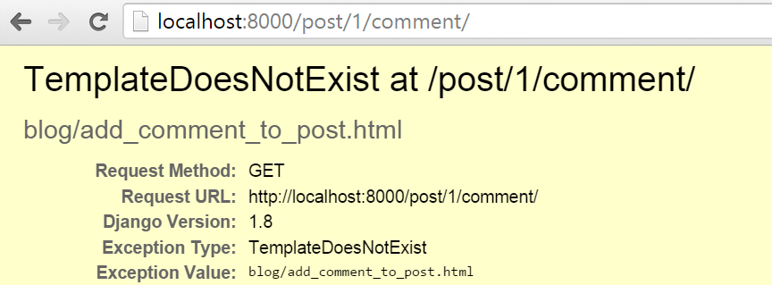

#  کار در خانه: ساختن مدل کامنت‌ها

در حال حاضر ما فقط یک مدل برای پست‌ها داریم. چطور است که بتوانیم بازخوردی از خوانندگان وبلاگ بگیریم و اجازه بدهیم برای پست‌ها کامنت بگذارند؟

## ساختن مدل برای کامنت‌های وبلاگ

فایل `blog/models.py` را باز کنید و این قطعه کد را به آن اضافه کنید:

```python
class Comment(models.Model):
    post = models.ForeignKey('blog.Post', on_delete=models.CASCADE, related_name='comments')
    author = models.CharField(max_length=200)
    text = models.TextField()
    created_date = models.DateTimeField(default=timezone.now)
    approved_comment = models.BooleanField(default=False)

    def approve(self):
        self.approved_comment = True
        self.save()

    def __str__(self):
        return self.text
```

شما می‌توانید به بخش **مدل‌ها در جنگو** در آموزش اصلی جنگوگرلز برگردید و اگر نیاز دارید ویژگی‌های هر نوع فیلد را دوره کنید.

در این تمرین ما یک نوع فیلد جدید داریم: 
- `models.BooleanField` - این فیلد یک نوع فیلد درست/غلط است.

گزینه `related_name` در `models.ForeignKey` به ما اجازه می‌دهد که از طریق مدل پست، به کامنت‌ها دسترسی داشته باشیم.

## ساختن جدول برای مدل‌ها در دیتابیس

الان زمان آن است که مدل کامنت‌ را به دیتابیس اضافه کنیم. برای این کار باید به جنگو بگوییم که ما چه تغییراتی در مدل ایجاد کرده‌ایم. دستور `python manage.py makemigrations blog` را در خط فرمان بنویسید. باید چیزی شبیه به این ببینید:

    (myvenv) ~/djangogirls$ python manage.py makemigrations blog
    Migrations for 'blog':
      0002_comment.py:
        - Create model Comment

می‌بینید که این دستور یک فایل مایگریشن دیگر برای ما در پوشه `blog/migrations/` می‌سازد. حالا نیاز داریم تا این تغییرات را با نوشتن دستور `python manage.py migrate blog`در خط فرمان، ثبت کنیم. نتیجه شبیه به این خواهد بود: 

```
    (myvenv) ~/djangogirls$ python manage.py migrate blog
    Operations to perform:
      Apply all migrations: blog
    Running migrations:
      Rendering model states... DONE
      Applying blog.0002_comment... OK
```

مدل کامنت ما حالا در دیتابیس وجود دارد! جالب نیست که ما از طریق پنل ادمین به آن دسترسی داشته باشیم؟

## ثبت مدل کامنت در پنل ادمین

برای ثبت مدل کامنت در پنل ادمین به فایل `blog/admin.py` بروید و خط زیر را پیدا کنید:

```python
admin.site.register(Post)
```
و دقیقاً در پایین آن، خط زیر اضافه کنید:

```python
admin.site.register(Comment)
```

به یاد داشته باشید که مدل کامنت را در بالای فایل به شکل زیر فراخوانی یا import کنید:

```python
from django.contrib import admin
from .models import Post, Comment

admin.site.register(Post)
admin.site.register(Comment)
```

اگر عبارت `python manage.py runserver` را در خط فرمان بنویسید و به آدرس [http://127.0.0.1:8000/admin/](http://127.0.0.1:8000/admin/) در مرورگر خود سر بزنید، به لیستی از کامنت‌ها دسترسی خواهید داشت و همچنین امکان آن را دارید که کامنتی اضافه یا کم کنید. کمی با این قابلیت کامنت‌ها بازی کنید! 

## کامنت‌هایمان را نمایش دهیم

به فایل `blog/templates/blog/post_detail.html` بروید و خطوط زیر را قبل از تگ `` اضافه کنید:

```django
<hr>

    <div class="comment">
        <div class="date">{{ comment.created_date }}</div>
        <strong>{{ comment.author }}</strong>
        <p>{{ comment.text|linebreaks }}</p>
    </div>

    <p>No comments here yet :(</p>

```

حالا می‌توانیم بخش کامنت‌ها را در صفحه جزییات پست ببینیم.

اما این بخش می‌تواند کمی جذاب‌تر هم باشد، پس بیایید کمی CSS به آن اضافه کنیم، در انتهای فایل `static/css/blog.css`، خطوط زیر را اضافه کنید:

```css
.comment {
    margin: 20px 0px 20px 20px;
}
```

همچنین می‌توانیم به خوانندگان در مورد کامنت‌های هر پست در صفحه لیست پست‌ها نیز اطلاع بدهیم. به فایل `blog/templates/blog/post_list.html`بروید و خط زیر را اضافه کنید:

```django
<a href="">Comments: {{ post.comments.count }}</a>
```

حالا تمپلیت ما شبیه به این خواهد بود:

```django



    
        <div class="post">
            <div class="date">
                {{ post.published_date }}
            </div>
            <h1><a href="">{{ post.title }}</a></h1>
            <p>{{ post.text|linebreaksbr }}</p>
            <a href="">Comments: {{ post.comments.count }}</a>
        </div>
    

```

## به کاربر اجازه نوشتن کامنت بدهیم

خب حالا می‌توانیم کامنت‌ها را در وبلاگ خود ببینیم، اما نمی‌توانیم کامنتی اضافه کنیم، بیایید این مشکل را حل کنیم!

به فایل `blog/forms.py` بروید و خطوط زیر را به انتهای فایل اضافه کنید:

```python
class CommentForm(forms.ModelForm):

    class Meta:
        model = Comment
        fields = ('author', 'text',)
```

به یاد داشته باشید که مدل کامنت را فراخوانی کنید، خط زیر را پیدا کنید:

```python
from .models import Post
```

و به این شکل تغییر دهید:

```python
from .models import Post, Comment
```

حالا به فایل `blog/templates/blog/post_detail.html` بروید و قبل از عبارت ``، این خط را اضافه کنید:

```django
<a class="btn btn-default" href="">Add comment</a>
```

اگر به صفحه جزییات پست بروید احتمالاً این خطا را خواهید دید:


ما می‌دانیم که چطور این مشکل را حل کنیم! به فایل `blog/urls.py` بروید و این الگو را به `urlpatterns` اضافه کنید:

```python
path('post/<int:pk>/comment/', views.add_comment_to_post, name='add_comment_to_post'),
```

صفحه را دوباره بارگذاری کنید، حالا یک خطای جدید داریم:


برای حل این مشکل به فایل `blog/views.py` بروید و ویو زیر را به آن اضافه کنید:

```python
def add_comment_to_post(request, pk):
    post = get_object_or_404(Post, pk=pk)
    if request.method == "POST":
        form = CommentForm(request.POST)
        if form.is_valid():
            comment = form.save(commit=False)
            comment.post = post
            comment.save()
            return redirect('post_detail', pk=post.pk)
    else:
        form = CommentForm()
    return render(request, 'blog/add_comment_to_post.html', {'form': form})
```

به یاد داشته باشید که `CommentForm` را در ابتدای فایل فراخوانی کنید:

```python
from .forms import PostForm, CommentForm
```

حالا در صفحه جزییات پست، باید کلید "Add Comment" را ببینید.


با اینحال وقتی روی آن کلیک کنید خطای زیر را خواهید دید: 




همان‌طور که این خطا نشان می‌دهد، تمپلیتی وجود ندارد بنابراین بیایید یک تمپلیت جدید در `blog/templates/blog/add_comment_to_post.html` بسازیم و کد زیر را به آن اضافه کنیم: 

```django



    <h1>New comment</h1>
    <form method="POST" class="post-form">
        {{ form.as_p }}
        <button type="submit" class="save btn btn-default">Send</button>
    </form>

```

وای! حالا خوانندگان شما می‌توانند نظرشان را در مورد پست‌های وبلاگ شما بنویسند!

## مدیریت کامنت‌ها

همه کامنت‌ها نباید نمایش داده شوند. صاحب وبلاگ، مثلاً شما، احتمالاً امکان تأیید یا پاک کردن یک کامنت را لازم دارد. پس بیایید کاری برای این موضوع انجام دهیم:

به فایل `blog/templates/blog/post_detail.html` بروید و خطوط زیر را پیدا کنید:

```django

    <div class="comment">
        <div class="date">{{ comment.created_date }}</div>
        <strong>{{ comment.author }}</strong>
        <p>{{ comment.text|linebreaks }}</p>
    </div>

    <p>No comments here yet :(</p>

```

و آن‌ها را به این شکل تغییر دهید:

```django

    
    <div class="comment">
        <div class="date">
            {{ comment.created_date }}
            
                <a class="btn btn-default" href=""><span class="glyphicon glyphicon-remove"></span></a>
                <a class="btn btn-default" href=""><span class="glyphicon glyphicon-ok"></span></a>
            
        </div>
        <strong>{{ comment.author }}</strong>
        <p>{{ comment.text|linebreaks }}</p>
    </div>
    

    <p>No comments here yet :(</p>

```

الان احتمالاً خطای `NoReverseMatch` را خواهید دید، چرا که هنوز هیچ URL با الگوی `comment_approve` و `comment_remove` مطابقت نمی‌کند.

برای اصلاح این خطا، این الگوها را به فایل `blog/urls.py` اضافه کنید:‌

```python
path('comment/<int:pk>/approve/', views.comment_approve, name='comment_approve'),
path('comment/<int:pk>/remove/', views.comment_remove, name='comment_remove'),
```

حالا احتمالاً خطای `AttributeError` را خواهید دید. برای اصلاح آن، ویوهای زیر را به فایل `blog/views.py` اضافه کنید: 

```python
@login_required
def comment_approve(request, pk):
    comment = get_object_or_404(Comment, pk=pk)
    comment.approve()
    return redirect('post_detail', pk=comment.post.pk)

@login_required
def comment_remove(request, pk):
    comment = get_object_or_404(Comment, pk=pk)
    comment.delete()
    return redirect('post_detail', pk=comment.post.pk)
```


لازم است که مدل `Comment` را در ابتدای فایل فراخوانی کنید:

```python
from .models import Post, Comment
```

همه چیز کار می‌کند! فقط یک تغییر کوچک باقی مانده که انجام بدهیم. در صفحه لیست پست‌ها، ما تعداد همه کامنت‌هایی که هر پست دریافت کرده را می‌بینیم. بیایید آن را به تعداد کامنت‌های *تأییدشده* تغییر بدهیم.

برای اصلاح این مورد به فایل `blog/templates/blog/post_list.html` بروید و خط زیر را پیدا کنید:

```django
<a href="">Comments: {{ post.comments.count }}</a>
```

و آن را به این شکل تغییر دهید:

```django
<a href="">Comments: {{ post.approved_comments.count }}</a>
```

حالا این متد را به مدل `Post` در فایل `blog/models.py` اضافه کنید:

```python
def approved_comments(self):
    return self.comments.filter(approved_comment=True)
```

حالا ویژگی‌های بخش کامنت کامل شد! تبریک! :-)
