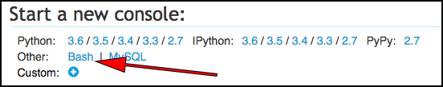
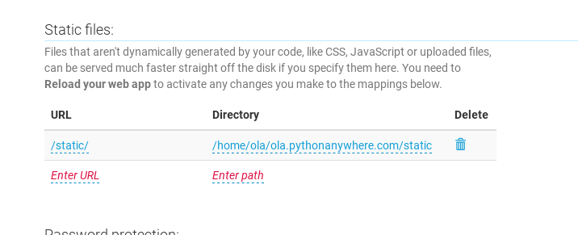

# انتشار دستی بر روی PythonAnywhere

در آموزش اصلی، ما برای انتشار اپ خود از اسکریپت اتوماتیک PythonAnywhere به صورت autoconfigure استفاده کردیم که کارهای جادویی زیادی برای ما انجام داد. در این آموزش اضافه، نگاهی به پشت صحنه خواهیم انداخت و با انتشار وبلاگ به صورت دستی، بررسی می‌کنیم که اسکریپت autoconfigure، واقعاً چطور کار می‌کند.

چرا باید به چنین چیزی علاقمند باشید؟ سوای کنجکاوی خالص، مراحلی که در اینجا طی می‌کنید  تقریباً مشابه مراحلی است که اگر بخواهید وبلاگ خود را روی هاست دیگری منتشر کنید. که با توجه به راه‌اندازی سرور مخصوص به خودتان ممکن است چند روزی زمان لازم داشته باشد.

طی کردن این مراحل به صورت غیر اتوماتیک همچنین برای مربیان جنگوگرلز کمک خوبی خواهد بود. اگر مشکلی با اسکریپت autoconfigure به‌وجود بیاید، دانستن روش عملکرد آن می‌تواند یک شرکت‌کننده را از بن‌بست خارج کرده به مراحل انتشار برگرداند.

پس به پیش برویم!

## پیش فرض‌ها

* این آموزش فرض می‌کند که شما در حال حاضر مقداری کد در گیتهاب دارید. اگر نیاز است ابتدای بخش انتشار را دوباره نگاه کنید.
* علاوه براین فرض کرده‌ایم که اکانت PythonAnywhere  هم دارید. اگر هنوز در این اکانت وب اپلیکیشن جنگو شما در حال کار است ابتدا باید آن را پاک کنید (یا یک اکانت جدید بسازید).

## بررسی اجمالی

انتشار بر روی PythonAnywhere یا هر سرور دیگری شامل تقریباً یکسری مراحل مشخص است:

* بردن کدها روی سرور. ما از دستورهای `git clone` و `git pull` برای این کار استفاده می‌کنیم.

* نصب وابستگی‌های مورد نیاز بر روی سرور. ما برای این‌کار از یک virtualenv استفاده می‌کنیم. شبیه آنچه روی کامپیوتر خودتان اتفاق افتاده بود اما این‌بار از میانبر پیشنهادی PythonAnywhere به نام `virtualenvwrapper` استفاده خواهیم کرد.

* تنظیم دیتابیس بر روی سرور. دیتابیس روی کامپیوتر شما و دیتابیس موجود روی سرور با هم متفاوت هستند. ما از دستورات `manage.py migrate` و `manage.py createsuperuser` برای تنظیم دیتابیس استفاده خواهیم کرد.

* تنظیم فایل‌های استاتیک بر روی سرور. روی لپ‌تاپ شما دستور `runserver` وظیفه ارائه کردن فایل‌های استاتیک را دارد، اما سرور دوست دارد کارها را به شکل دیگری انجام دهد تا ارائه این فایل‌ها بهینه‌تر باشد. اینجا ما از یک دستور جدید به نام `collectstatic` استفاده می‌کنیم و از طریق تب Web در **PythonAnywhere** فایل‌های استاتیک را تنظیم خواهیم کرد.

*و در نهایت وصل کردن اپ جنگو، برای اینکه در اینترنت و به طور زنده ارائه شود. ما این کار را در **Web tab** در PythonAnywhere و به وسیله چیزی به اسم **WSGI file** انجام خواهیم داد.


## آوردن کدها به PythonAnywhere

به [PythonAnywhere Dashboard](https://www.pythonanywhere.com) بروید و گزینه شروع کنسول "Bash" را بزنید، این نسخه خط فرمان PythonAnywhere است شبیه همان که روی کامپیوتر خود دارید.




> **نکته** PythonAnywhere بر اساس لینوکس است، بنابراین در کامپیوتر ویندوزی، کنسول خط فرمان ممکن است کمی متفاوت باشد.

حالا بیاید که کدها را از گیتهاب و به کمک ساخت یک کپی از ریپازیتوری مان به PythonAnywhere بیاوریم. دستور زیر را در کنسول PythonAnywhere تایپ کنید:

PythonAnywhere command-line
```
$ git clone https://github.com/<your-github-username>/my-first-blog.git <your-pythonanywhere-username>.pythonanywhere.com
```

* از نام کاربری واقعی خود در گیتهاب به جای `<your-github-username>` استفاده کنید
* و به جای `<your-pythonanywhere-username>` هم از نام کاربری خود در PythonAnywhere استفاده کنید.

این کار یک کپی از کدهای شما را به PythonAnywhere می آورد و آن‌ها در پوشه‌ای به نام وبسایت (آینده) شما قرار می‌دهد. با تایپ دستور `tree` آن را چک کنید:

PythonAnywhere command-line
```
$ tree
ola.pythonanywhere.com/
├── blog
│   ├── __init__.py
│   ├── admin.py
│   ├── migrations
│   │   ├── 0001_initial.py
│   │   └── __init__.py
│   ├── models.py
│   ├── tests.py
│   └── views.py
├── manage.py
└── mysite
    ├── __init__.py
    ├── settings.py
    ├── urls.py
    └── wsgi.py
```


### ساخت یک virtualenv بر روی PythonAnywhere

همانطور که قبل‌تر روی کامپیوتر خود امتحان کردید، لازم است که یک محیط مجازی روی PythonAnywhere بسازید. در کنسول Bash تایپ کنید:

PythonAnywhere command-line
```
$ mkvirtualenv --python=python3.6 <your-pythonanywhere-username>.pythonanywhere.com
Running virtualenv with interpreter /usr/bin/python3.6
[...]
Installing setuptools, pip...done.
```

`mkvirtualenv` از ابزاری به نام "virtualenvwrapper" استفاده می‌کند که PythonAnywhere آن را توصیه می‌کند. این‌ دستورات مجموعه‌ای از میانبرها هستند که به دستور معمولی `virtualenv` که قبلاً روی کامپیوتر خود استفاده کرده بودید، اضافه شده‌اند.

وقتی که دستور تمام شد، محیط مجازی شما باید فعال شده باشد. ما اسم آن را شبیه نام پروژه شما خواهیم گذاشت، همانند نام پوشه کدهای اصلی پروژه. حالا بیایید برای تمرین محیط مجازی را فعال و غیرفعال کنیم.

غیرفعال کردن به کمک دستور `deactivate` است، شبیه به آنچه در کامپیوتر خود داشتید. ولی برای فعال کردن می‌توانید از میانبر تهیه شده توسط virtualenvwrapper یعنی `workon` استفاده کنیم و فقط به نام محیط مجازی مان احتیاج داریم:

PythonAnywhere command-line
```
(ola.pythonanywhere.com) $ deactivate
$  which python
/usr/bin/python
$  workon <your-pythonanywhere-username>.pythonanywhere.com
(ola.pythonanywhere.com) $ which python
/home/ola/.virtualenvs/ola.pythonanywhere.com/bin/python
```

حالا بیایید جنگو را در محیط مجازی‌مان بر روی PythonAnywhere نصب کنیم

PythonAnywhere command-line
```
(ola.pythonanywhere.com) $ pip install 'django<2'
Collecting django
[...]
Successfully installed django-1.11.9
```
> **نکته** دستور `pip install` ممکن است دقایقی طول بکشد پس صبر داشته باشید اما اگر بیش از پنج دقیقه طول کشید از مربی خود کمک بگیرید.

<!--TODO: think about using requirements.txt instead of pip install.-->


### ساخت دیتابیس بر روی PythonAnywhere

اینجا یک کار دیگر هم هست که روی کامپیوتر خودتان انجام دادید اما  روشی که این کار را روی سرور انجام می‌دهیم متفاوت است: از دیتابیس متفاوتی استفاده می‌کنیم. بنابراین اطلاعات کاربری و پست‌های وبلاگ بر روی کامپیوتر خودتان و سرور متفاوت خواهد بود.

همانند کاری که روی کامپوتر خودتان انجام دادید، ما مراحل راه اندازی دیتابیس را به کمک دستورهای `migrate` و `createsuperuser` بر روی سرور انجام می‌دهیم:

به کنسول Bash برگردید، مطمئن شوید که محیط مجازی شما هنوز فعال است، سپس دستورهای زیر را اجرا کنید. (اگر کنسول را بسته‌اید می‌توانید یک کنسول جدید باز کنید و به کمک دستور `workon` محیط مجازی را دوباره فعال کنید).

PythonAnywhere command-line
```
(ola.pythonanywhere.com) $ python manage.py migrate
Operations to perform:
[...]
  Applying sessions.0001_initial... OK
(ola.pythonanywhere.com) $ python manage.py createsuperuser
```

### جمع‌آوری فایل‌های استاتیک

حالا یک دستور جدید یاد گرفته‌ایم، `collecstatic` که وظیفه آن جمع‌آوری تمام فایل‌های استاتیک از اپ شماست (شامل اپ‌هایی مثل *blog* که خودتان نوشته‌اید یا اپ‌های پیش ساخته موجود در جنگو مانند *admin*)، علاوه بر این همه آن‌ها را در یک محل قرار می‌دهد تا سرور به سادگی آن‌ها را پیدا کند:

PythonAnywhere command-line
```
(ola.pythonanywhere.com) $ python manage.py collectstatic
You have requested to collect static files at the destination
[...]
Are you sure you want to do this?
[...]
62 static files copied to '/home/ola/ola.pythonanywhere.com/static'.
```


## انتشار وبلاگ به صورت یک وب اپلیکیشن

حالا که کد ما روی PythonAnywhere است، محیط مجازی ما آماده است و دیتابیس آماده شده، آماده هستیم تا به صورت یک وب اپلیکیشن آن را منتشر کنیم!

به داشبورد PythonAnywhere برگردید و بر روی لوگوی آن کلیک کنید و سپس بر روی تب **Web** کلیک کنید. در نهایت گزینه **Add a new web app** را انتخاب کنید.

پس از انتخاب نام دامین، گزینه **manual configuration** را انتخاب کنید (توجه کنید که گزینه "Django" را *انتخاب نکنید*). سپس **Python 3.6** را انتخاب کنید و Next  را بزنید تا مراحل راهنما تمام شود.

> **نکته** مطمئن شوید که گزینه "Manual configuration" را انتخاب کرده باشید و اشتباهی گزینه "Django" را انتخاب نکرده باشید. ما برای انتخاب تنظیمات جنگو در PythonAnywhere خیلی راحت هستیم.  ;-)

### تنظیم کردن virtualenv

هر زمان که بخواهید تنظیمات اپ خود را روی سرور اصلاح کنید باید به صفحه کانفیگ PythonAnywhere مرتبط با اپ خود بروید.


در بخش "Virtualenv"، بر روی نوشته قرمز "Enter the path to a virtualenv" کلیک کنید و عبارت `/home/<your-PythonAnywhere-username>/my-first-blog/myvenv/` را وارد کنید. بر روی دکمه آبی رنگ با علامت تیک، کلیک کنید تا مسیر مورد نظر ذخیره شود.

> **نکته** نام کاربری PythonAnywhere خودتان را جایگزین کنید. اگر اشتباهی کنید PythonAnywhere به شما پیغام خطایی را نشان خواهد داد.

### اضافه کردن مسیردهی فایل‌های استاتیک

ما باید به PythonAnywhere اعلام کنیم که تمام فایل‌های استاتیک ما در پوشه `/static/` در سورس کد پروژه قرار دارد. ما این کار را در بخش "Static Files" در تب Web انجام می‌دهیم.

بر روی نوشته قرمز "Enter URL" کلیک کنید و `/static/` را وارد کنید و بر روی دکمه آبی رنگ با علامت تیک، کلیک کنید تا تغییرات ذخیره شود. سپس بر روی نوشته "Enter path" کلیک کنید و `/home/<your-pythonanywhere-username>/<your-pythonanywhere-username.pythonanywhere.com/static` را وارد کنید (از نام کاربری خود استفاده کنید):



### تنظیم فایل WSGI

جنگو به کمک "WSGI protocol" کار می‌کند، یک سیستم استاندارد ارائه وبسایت به کمک پایتون است که PythonAnywhere نیز آن را پشتیبانی می‌کند. روشی که ما PythonAnywhere را تنظیم می‌کنیم که بلاگ جنگویی ما را تشخیص دهد به کمک تنظیم فایل WSGI است.

بر روی لینک "WSGI configuration file" ( در بخش "Code" نزدیک به بالای صفحه که چیزی شبیه به `/var/www/<your-PythonAnywhere-username>_pythonanywhere_com_wsgi.py` باید باشد) کلیک کنید. به یک ادیتور متصل خواهید شد.

تمام محتویات را پاک کنید و کد زیر را به جای آن اضافه کنید:

&lt;your-username&gt;_pythonanywhere_com_wsgi.py
```python
import os
import sys

path = '/home/<your-pythonanywhere-username>/<your-pythonanywhere-username>.pythonanywhere.com')
if path not in sys.path:
    sys.path.append(path)

os.environ['DJANGO_SETTINGS_MODULE'] = 'mysite.settings'

from django.core.wsgi import get_wsgi_application
application = get_wsgi_application()
```
> **نکته** مانند همیشه از نام کاربری خودتان استفاده کنید

وظیفه این فایل این است که به PythonAnywhere اعلام کند که وب اپلیکیشن ما کجاست و فایل تنظیمات جنگویی آن کجا قرار دارد.

دکمه **Save** را بزنید و به تب **Web** برگردید.

کار ما تمام است! دکمه بزرگ سبز **Reload** را بزنید و حالا می‌توانید اپلیکیشن خود را ببینید. می‌توانید یک لینک به اپلیکیشن خود در بالای صفحه، پیدا کنید.

## راهنمای رفع مشکل

اگر برای مشاهده سایت خود ایرادی مشاهده کردید، اولین جایی که برای بررسی مشکل باید مراجعه کنید **error log**  است. یک لینک [Web tab](https://www.pythonanywhere.com/web_app_setup/) در PythonAnywhere برای این قضیه تعبیه شده است. ببینید آیا پیغام خطایی آنجا هست. جدیدترین خطاها معمولاً در پایین هستند. مشکلات رایج شامل این موارد است:

- فراموش کردن مراحلی که در کنسول انجام داده‌ایم: ساخت محیط مجازی، فعال کردن آن، نصب جنگو در آن، میگریت کردن دیتابیس.

- اشتباه کردن در مسیر مربوط به virtualenv در تب Web. معمولاً اگر مشکلی در این قضیه باشد پیغام خطای قرمز رنگی مشاهده خواهید کرد.

- اشتباه کردن در تنظیمات فایل WSGI. آیا مسیر به سمت پوشه پروژه را درست وارد کرده‌اید؟

- آیا نسخه یکسانی برای پایتون در virtualenv و وب اپ انتخاب کرده‌اید هر دو باید 3.6باشد.

علاوه بر این‌ها موارد دیگری هم در لینک [general debugging tips on the PythonAnywhere wiki](https://www.pythonanywhere.com/wiki/DebuggingImportError) اشاره شده است.
