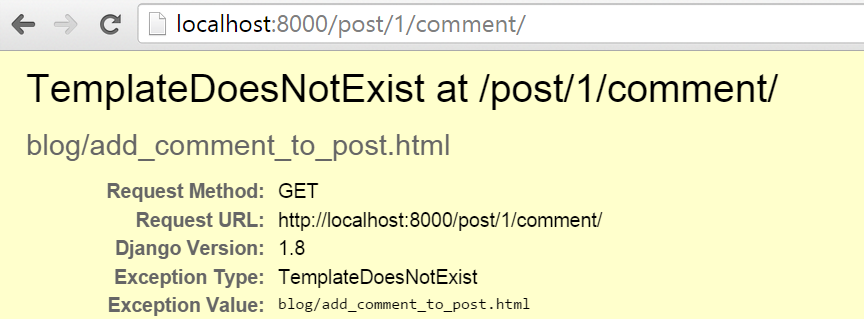

# Homework: create comment model

Now we only have Post model, what about receiving some feedback from your readers?

## Creating comment blog model

Let's open `blog/models.py` and append this piece of code to the end of file:

```python
class Comment(models.Model):
    post = models.ForeignKey('blog.Post', related_name='comments')
    author = models.CharField(max_length=200)
    text = models.TextField()
    created_date = models.DateTimeField(default=timezone.now)
    approved_comment = models.BooleanField(default=False)

    def approve(self):
        self.approved_comment = True
        self.save()

    def __str__(self):
        return self.text
```

You can go back to **Django models** chapter in tutorial if you need to remind yourself what each of field types means.

In this chapter we have new type of field:
- `models.BooleanField` - this is true/false field.

And `related_name` option in `models.ForeignKey` allow us to have access to comments from post model.

## Create tables for models in your database

Now it's time to add our comment model to database. To do this we have to let know Django that we made changes in our model. Type `python manage.py makemigrations blog`. Just like this:

    (myvenv) ~/djangogirls$ python manage.py makemigrations blog
    Migrations for 'blog':
      0002_comment.py:
        - Create model Comment

You can see that this command created for us another migration file in `blog/migrations/` directory. Now we need to apply those changes with `python manage.py migrate blog`. It should look like this:

    (myvenv) ~/djangogirls$ python manage.py migrate blog
    Operations to perform:
      Apply all migrations: blog
    Running migrations:
      Rendering model states... DONE
      Applying blog.0002_comment... OK

Our Comment model exists in database now. It would be nice if we had access to it in our admin panel.

## Register comment model in admin panel

To register model in admin panel, go to `blog/admin.py` and add line:

```python
admin.site.register(Comment)
```

Don't forget to import Comment model, file should look like this:

```python
from django.contrib import admin
from .models import Post, Comment

admin.site.register(Post)
admin.site.register(Comment)
```

If you type `python manage.py runserver` in command prompt and go to [http://127.0.0.1:8000/admin/](http://127.0.0.1:8000/admin/) in your browser, you should have access to list, add and remove comments. Don't hesitate to play with it!

## Make our comments visible

Go to `blog/templated/blog/post_detail.html` file and add those lines before `` tag:

```django
<hr>

    <div class="comment">
        <div class="date">{{ comment.created_date }}</div>
        <strong>{{ comment.author }}</strong>
        <p>{{ comment.text|linebreaks }}</p>
    </div>

    <p>No comments here yet :(</p>

```

Now we can see the comments section on pages with post details.

But it can look a little bit better, add some css to `static/css/blog.css`:

```css
.comment {
    margin: 20px 0px 20px 20px;
}
```

We can also let know about comments on post list page, go to `blog/templates/blog/post_list.html` file and add line:

```django
<a href="">Comments: {{ post.comments.count }}</a>
```

After that our template should look like this:

```django



    
        <div class="post">
            <div class="date">
                {{ post.published_date }}
            </div>
            <h1><a href="">{{ post.title }}</a></h1>
            <p>{{ post.text|linebreaks }}</p>
            <a href="">Comments: {{ post.comments.count }}</a>
        </div>
    

```

## Let your readers write comments

Right now we can see comments on our blog, but we cannot add them, let's change that!

Go to `blog/forms.py` and add those lines to the end of the file:

```python
class CommentForm(forms.ModelForm):

    class Meta:
        model = Comment
        fields = ('author', 'text',)
```

Don't forget to import Comment model, change line:

```python
from .models import Post
```

into:

```python
from .models import Post, Comment
```

Now go to `blog/templates/blog/post_detail.html` and before line `` add:

```django
<a class="btn btn-default" href="">Add comment</a>
```

Go to post detail page and you should see error:


Let's fix this! Go to `blog/urls.py` and add this pattern to `urlpatterns`:

```python
url(r'^post/(?P<pk>[0-9]+)/comment/$', views.add_comment_to_post, name='add_comment_to_post'),
```

Now you should see this error:


To fix this, add this piece of code to `blog/views.py`:

```python
def add_comment_to_post(request, pk):
    post = get_object_or_404(Post, pk=pk)
    if request.method == "POST":
        form = CommentForm(request.POST)
        if form.is_valid():
            comment = form.save(commit=False)
            comment.post = post
            comment.save()
            return redirect('blog.views.post_detail', pk=post.pk)
    else:
        form = CommentForm()
    return render(request, 'blog/add_comment_to_post.html', {'form': form})
```

Don't forget about imports at the beginning of the file:

```python
from .forms import PostForm, CommentForm
```

Now you should see:




Like error mentions, template does not exist, create one as `blog/templates/blog/add_comment_to_post.html` and add those lines:

```django



    <h1>New comment</h1>
    <form method="POST" class="post-form">
        {{ form.as_p }}
        <button type="submit" class="save btn btn-default">Send</button>
    </form>

```

Yay! Now your readers can let you know what they think below your posts!

## Moderating your comments

Not all of our comments should be displayed. Blog owner should have option to approve or delete comments. Let's do something about it.

Go to `blog/templates/blog/post_detail.html` and change lines:

```django

    <div class="comment">
        <div class="date">{{ comment.created_date }}</div>
        <strong>{{ comment.author }}</strong>
        <p>{{ comment.text|linebreaks }}</p>
    </div>

    <p>No comments here yet :(</p>

```

to:

```django

    
    <div class="comment">
        <div class="date">
            {{ comment.created_date }}
            
                <a class="btn btn-default" href=""><span class="glyphicon glyphicon-remove"></span></a>
                <a class="btn btn-default" href=""><span class="glyphicon glyphicon-ok"></span></a>
            
        </div>
        <strong>{{ comment.author }}</strong>
        <p>{{ comment.text|linebreaks }}</p>
    </div>
    

    <p>No comments here yet :(</p>

```

You should see `NoReverseMatch`, because no url matches `comment_remove` and `comment_approve` patterns.

Add url patterns to `blog/urls.py`:

```python
url(r'^comment/(?P<pk>[0-9]+)/approve/$', views.comment_approve, name='comment_approve'),
url(r'^comment/(?P<pk>[0-9]+)/remove/$', views.comment_remove, name='comment_remove'),
```

Now you should see `AttributeError`. To get rid of it, create more views in `blog/views.py`:

```python
@login_required
def comment_approve(request, pk):
    comment = get_object_or_404(Comment, pk=pk)
    comment.approve()
    return redirect('blog.views.post_detail', pk=comment.post.pk)

@login_required
def comment_remove(request, pk):
    comment = get_object_or_404(Comment, pk=pk)
    post_pk = comment.post.pk
    comment.delete()
    return redirect('blog.views.post_detail', pk=post_pk)
```

And of course fix imports.

Everything works, but there is one misconception. In our post list page under posts we see number of all comments attached, but we want to have number of approved comments there.

Go to `blog/templates/blog/post_list.html` and change line:

```django
<a href="">Comments: {{ post.comments.count }}</a>
```

to:

```django
<a href="">Comments: {{ post.approved_comments.count }}</a>
```

And also add this method to Post model in `blog/models.py`:

```python
def approved_comments(self):
    return self.comments.filter(approved_comment=True)
```

Now your comment feature is finished! Congrats! :-)
