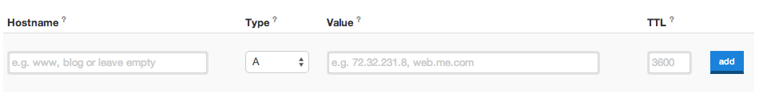

# ドメイン

PythonAnywhereというホスティングサイトでは、無料でドメインがもらえます。でも「.pythonanywhere.com」がブログのURLのおわりについてしまうのはいやかもしれません。「www.infinite-kitten-pictures.org」とか「www.3d-printed-steam-engine-parts.com」や「www.antique-buttons.com」や「www.mutant-unicornz.net」みたいなドメインのほうがいいかもしれませんね。

ここではドメインを取る方法とPythonAnywhereでホスティングしたウェブアプリにそのドメインを割り当てる方法を取り上げます。知ってるかもしれませんが、ドメインを取るにはお金がかかります。PythonAnywhereでも自分のドメイン名を使うには月額料金がかかります(そんなに高くはありません。でも本気でやりたいなら払ってもいいかもしれませんね!)。

## どこでドメインを登録するか?

普通のドメインはだいたい年間15USドルぐらいかかります。もっと安いドメインもあるし、もっと高いものもあります。値段はドメイン・プロバイダー次第です。 ドメイン業者はたくさんあります。[Googleで検索](https://www.google.com/search?q=register%20domain)するとたくさん出てきます。

Django Girlsのお気に入りは[I want my name](https://iwantmyname.com/)です。「苦労しないドメイン管理」をうたっていますし、ほんとに苦労しません。

無料でドメインを取ることもできます。例えば[dot.tk](http://www.dot.tk)です。でも無料のドメインだと安っぽいと感じるかもしれません。もし会社のサイトを作るつもりなら、「.com」で終わる「正式」なドメインを考えたほうがいいかもしれません。

## PythonAnywhereに取得したドメインを向ける

 *iwantmyname.com* をひらいたら、メニューの `Domains` をクリックして、新しく買ったドメインを選んでください。それから `manage DNS records` のリンクを探してクリックします。

それから、下の画像のフォームを探してください。

見つかったら、下のとおりに入力してください。
- Hostname: www
- Type: CNAME
- Value: PythonAnywhereでもらったドメイン (例えば、djangogirls.pythonanywhere.com)
- TTL: 60

「Add」ボタンを押してから、下の方にある「Save changes」を押してください

> **注意** **iwantymyname.com**以外のドメイン業者を使った場合、DNSやCNAMEの設定を検索をする画面のUIが上の画像とは違います。でもやることは同じです。CNAMEが `yourusername.pythonanywhere.com` というPythonAnywhareで取得したドメインに向くようにしてください。

ドメインが実際に動き始めるまで数分かかります。あせらず待ちましょう!

## PythonAnywhereのドメインの設定をする

PythonAnywhereにも取得したカスタムドメインを使うための設定が必要です。

[PythonAnywhere Accounts page](https://www.pythonanywhere.com/account/)を開いて、アカウントをアップグレードしましょう。一番安い「Hacker」プランで大丈夫です。プランの変更はいつでもできます。変更するのはサイトがものすごく有名になってヒット数が数百万になったらでよいでしょう。

さて、次に[Web tab](https://www.pythonanywhere.com/web_app_setup/)を開いてください。

*  **path to your virtualenv** をどこかに書き留めて、保管しておいてください。
*  **wsgi config file** をクリックしてください。出てきた内容を書き留めて、保管しておいてください。

続いて、 古いウェブアプリを**Delete**を押して、削除します。削除と言っても、コードが全部消えたりしませんので安心してください。*yourusername.pythonanywhere.com* のドメインが無効になるだけです。消したら新しいウェブアプリを作りましょう。下のとおりにしてください。

* 新しいドメイン名を入れる
* 「manual configuration」を選ぶ
* 「Python 3.4」を選ぶ
* 完了!

「web」タブに戻ったら・・・

* さっき保存した「virtualenv path」の内容を貼り付けてください
* 「wsgi configuration file」の中に、さっき保存した「wsgi config file」の内容を貼り付けてください

ブラウザに新しいドメインを入力してください。あなたのウェブアプリが動いてるのがわかるはずです。

PythonAnywhereでは、うまく行かないことがあったら、「Send feedback」を押してください。管理者の誰かがすぐに助けてくれます。
