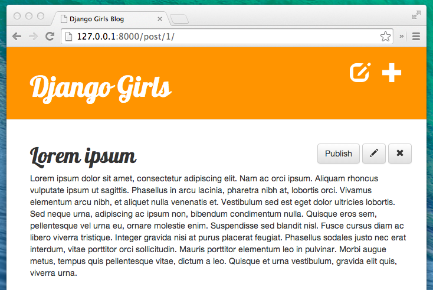

# 宿題: ウェブサイトにもっと機能を追加しよう!

ここまでは長い道のりでしたが、まだまだ私たちのブログには改善の余地があります。つづいて、記事の草稿を作成して、それを投稿する機能を作ります。長らく追加したかった、投稿を削除する機能もつけましょう。すごい!

## あたらしい記事を草稿として保存する

いまのところ、*New Post* フォームから記事を作成すると、そのままブログに記事が掲載されます。書いた記事をブログに表示せず、草稿として保存するには、`blog/views.py` の `post_new` 関数と `post_edit` 関数にある下の行を**削除**してください。

```python
post.published_date = timezone.now()
```

こうすると新しい記事は草稿として保存されます。記事はいきなり掲載されず、あとで見直すことができるようになりました。今必要なのは保存された草稿をリストアップする機能と、草稿をブログ上に掲載する機能です。それではやってみましょう!

## 草稿の一覧ページを作る

DjangoのQuerySetsを勉強した章を覚えていますか? `post_list` のビューを作って、ブログに掲載されている記事( `published_date` がカラではない記事)だけを表示するようにしました。

ここでは、それと同じようなことをして、草稿が表示されるようにしましょう。

`blog/templates/blog/base.html` のヘッダーにリンクを追加しましょう。草稿の一覧は誰でも見れるようにはしません。なので、新しい投稿を追加するボタンのすぐ後にある、 `` の条件文の中にリンクを書いてください。

```django
<a href="" class="top-menu"><span class="glyphicon glyphicon-edit"></span></a>
```

次は `blog/urls.py` に、urlを追加しましょう!

```python
url(r'^drafts/$', views.post_draft_list, name='post_draft_list'),
```

続いて `blog/views.py` にビューを作ります。

```python
def post_draft_list(request):
    posts = Post.objects.filter(published_date__isnull=True).order_by('created_date')
    return render(request, 'blog/post_draft_list.html', {'posts': posts})
```

`posts = Post.objects.filter(published_date__isnull=True).order_by('created_date')` の行では `filter(published_date__isnull=True)` で、草稿だけを集めています。そうして、`order_by('created_date')` で `created_date` 順に並べています。

最後にやるのはもちろんテンプレートの作成です! `blog/templates/blog/post_draft_list.html` を作成して、下の記述を加えます。

```django



    
        <div class="post">
            <p class="date">created: {{ post.created_date|date:'d-m-Y' }}</p>
            <h1><a href="">{{ post.title }}</a></h1>
            <p>{{ post.text|truncatechars:200 }}</p>
        </div>
    

```

これって `post_list.html` の内容と似ていませんか?

それでは `http://127.0.0.1:8000/drafts/` を開いてみましょう。草稿のリストが表示されるはずです。

やった! これで1つ完了です!

## 掲載ボタンをつける

投稿の詳細ページに、押したらすぐに記事が掲載できるようなボタンがあるといいと思いませんか?

`blog/templates/blog/post_detail.html` を開いて、下の行を・・・

```django

    <div class="date">
        {{ post.published_date }}
    </div>

```

下のように変更してください。

```django

    <div class="date">
        {{ post.published_date }}
    </div>

    <a class="btn btn-default" href="">Publish</a>

```

ご覧の通り、`` を追加しました。これは、記事が `` の条件に当てはまらない(記事に `published_date` が無い)ときに、 `<a class="btn btn-default" href="">Publish</a>` を表示する、と言う意味です。  `` のキーワード引数である `pk` に値を渡しています。

それでは  `blog/urls.py` に新しいURLを追加しましょう。

```python
url(r'^post/(?P<pk>\d+)/publish/$', views.post_publish, name='post_publish'),
```

最後にいつものように `blog/views.py` に *ビュー* を追加します。

```python
def post_publish(request, pk):
    post = get_object_or_404(Post, pk=pk)
    post.publish()
    return redirect('post_detail', pk=pk)
```

`Post` モデルを作ったときに、`publish` 関数も作りました。こんな感じでしたね・・・

```python
def publish(self):
    self.published_date = timezone.now()
    self.save()
```

いよいよこの関数の出番です!

記事が掲載されるとすぐに `post_detail` ページにリダイレクトされます。


おめでとうございます! もうすぐ完成です。最後のステップとして削除ボタンを作りましょう。

## 記事の削除

`blog/templates/blog/post_detail.html` をもう一度開いてください。
下の行を編集ボタンのすぐ下の行に追加します

```django
<a class="btn btn-default" href=""><span class="glyphicon glyphicon-remove"></span></a>
```

`blog/urls.py` にURLも必要ですね。

```python
url(r'^post/(?P<pk>\d+)/remove/$', views.post_remove, name='post_remove'),
```

次はビューも作りましょう。 `blog/views.py` を開いて下のコードを追加してください。

```python
def post_remove(request, pk):
    post = get_object_or_404(Post, pk=pk)
    post.delete()
    return redirect('post_list')
```

ここで新しく覚えてほしいのは記事を消す方法です。全てのDjangoのモデルは `.delete()` で削除できます。簡単ですね!

さっき草稿を消したあとは草稿の一覧ページに飛ぶようにしました。ここでは、記事を消したあとは、記事の一覧ページに飛びたいです。なので `redirect` を使っています。

テストしてみましょう! 投稿を表示して削除してみてください!



このチュートリアルはこれでおわりです! よく頑張りましたね!
