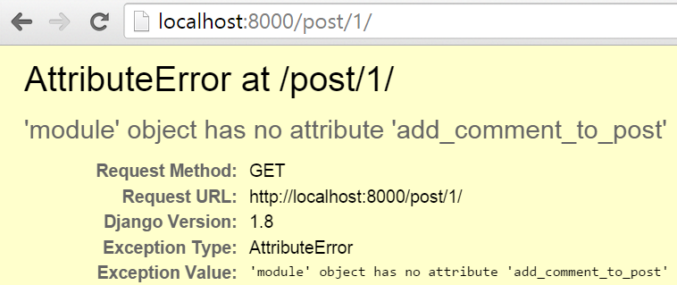
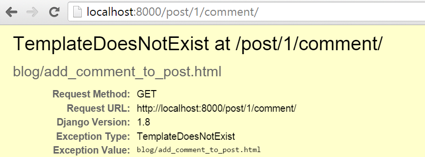

# 宿題:コメントモデルを作ろう

現在、ポストモデルしかありません。 あなたの読者からいくつかのフィードバックを受け取り、彼らにコメントさせるのはどうでしょうか？

## ブログにコメントモデルを作る

`blog/models.py`を開き、このコードをファイルの最後に追加しましょう：

```python
class Comment(models.Model):
    post = models.ForeignKey('blog.Post', on_delete=models.CASCADE, related_name='comments')
    author = models.CharField(max_length=200)
    text = models.TextField()
    created_date = models.DateTimeField(default=timezone.now)
    approved_comment = models.BooleanField(default=False)

    def approve(self):
        self.approved_comment = True
        self.save()

    def __str__(self):
        return self.text
```

各フィールドタイプの意味を思い出す必要がある場合は、チュートリアルの**Djangoモデル**の章に戻ることができます。

拡張版チュートリアルでは、新しいフィールドタイプが登場します：
- `models.BooleanField` - こちらはtrue/falseの値が入るフィールドです。

`models.ForeignKey`の`related_name`引数は、ポストモデルの中からコメントにアクセスできるようにします。

## データベースにモデルのテーブルを作る

今度は、コメントモデルをデータベースに追加します。 これを行うには、モデルを変更したことをDjangoに伝えなければなりません。 コマンドラインに `python manage.py makemigrations blog`と入力してください。 次のような出力が表示されます：

    (myvenv) ~/djangogirls$ python manage.py makemigrations blog
    Migrations for 'blog':
      0002_comment.py:
        - Create model Comment

このコマンドが`blog/migrations/`ディレクトリに別のマイグレーションファイルを作成したことがわかります。 コマンドラインで `python manage.py migrate blog`とタイプして変更を適用する必要があります。 出力は次のようになります：

```
    (myvenv) ~/djangogirls$ python manage.py migrate blog
    Operations to perform:
      Apply all migrations: blog
    Running migrations:
      Rendering model states... DONE
      Applying blog.0002_comment... OK
```

コメントモデルは今データベースに存在します！ 管理画面でアクセスできたら素敵ですよね？

## 管理画面にコメントモデルを登録する

管理画面にコメントモデルを登録するため、`blog/admin.py`ファイルに以下の行を追加してください：

```python
admin.site.register(Comment)
```

追加する位置は、この行の直下です：

```python
admin.site.register(Post)
```

コメントモデルをファイルの先頭でインポートすることも忘れないようにしてください：

```python
from django.contrib import admin
from .models import Post, Comment

admin.site.register(Post)
admin.site.register(Comment)
```

コマンドラインで`python manage.py runserver`を入力し、あなたのブラウザで [http://127.0.0.1:8000/admin/](http://127.0.0.1:8000/admin/) に行くと、コメントリストにアクセスすることができ、コメントの追加と削除の機能が使えるようになります。新しいコメント機能で遊んでみましょう！

## コメントを見えるようにする

`blog/templates/blog/post_detail.html`というファイルを開き、``タグの前に、以下の行を追加してください：

```django
<hr>

    <div class="comment">
        <div class="date">{{ comment.created_date }}</div>
        <strong>{{ comment.author }}</strong>
        <p>{{ comment.text|linebreaks }}</p>
    </div>

    <p>No comments here yet :(</p>

```

これで投稿の詳細ページでコメントを見ることができます。

でも、コメントをもう少し良く見せられるかもしれませんね。 `static/css/blog.css`ファイルの一番下にいくつかのCSSを追加しましょう：

```css
.comment {
    margin: 20px 0px 20px 20px;
}
```

投稿一覧ページでコメントについて、訪問者に知らせることもできます。 `blog/templates/blog/post_list.html`ファイルを開き、次の行を追加します：

```django
<a href="">Comments: {{ post.comments.count }}</a>
```

追加したら、テンプレートは次のようになります：

```django



    
        <div class="post">
            <div class="date">
                {{ post.published_date }}
            </div>
            <h1><a href="">{{ post.title }}</a></h1>
            <p>{{ post.text|linebreaksbr }}</p>
            <a href="">Comments: {{ post.comments.count }}</a>
        </div>
    

```

## 読者がコメントを書けるようにする

今は私たちのブログでコメントを見ることができますが、追加することはできません。 それを変えましょう！

`blog/forms.py`を開き、以下の行をファイルの最後に追加します：

```python
class CommentForm(forms.ModelForm):

    class Meta:
        model = Comment
        fields = ('author', 'text',)
```

コメントモデルをインポートすることを忘れないでください。以下の行を変更して：

```python
from .models import Post
```

このようにします：

```python
from .models import Post, Comment
```

今度は、`blog/templates/blog/post_detail.html`を開き、``の前に以下の行を追加します：

```django
<a class="btn btn-default" href="">Add comment</a>
```

もし投稿詳細ページに行くと、以下のエラーが表示されます：


私たちはそれを修正する方法を知っています！ `blog/urls.py`を開き、このパターンを`urlpatterns`に追加してください：

```python
url(r'^post/(?P<pk>\d+)/comment/$', views.add_comment_to_post, name='add_comment_to_post'),
```

ページを更新したら、また違うエラーが出てきます！



こちらのエラーを修正するために、`blog/views.py`に以下のビューを追加してください：

```python
def add_comment_to_post(request, pk):
    post = get_object_or_404(Post, pk=pk)
    if request.method == "POST":
        form = CommentForm(request.POST)
        if form.is_valid():
            comment = form.save(commit=False)
            comment.post = post
            comment.save()
            return redirect('post_detail', pk=post.pk)
    else:
        form = CommentForm()
    return render(request, 'blog/add_comment_to_post.html', {'form': form})
```

`CommentForm`をファイルの先頭でインポートすることを忘れないでください：

```python
from .forms import PostForm, CommentForm
```

今、詳細投稿ページで”Add Comment”というボタンが表示されています。


しかし、そのボタンをクリックしたら、次のように表示されます：




表示されたエラーが伝えているように、テンプレートは存在していないので、`blog/templates/blog/add_comment_to_post.html`という新しいテンプレートを作り、以下のコードを追加してください：

```django



    <h1>New comment</h1>
    <form method="POST" class="post-form">
        {{ form.as_p }}
        <button type="submit" class="save btn btn-default">Send</button>
    </form>

```

わーい！ 今あなたの読者は、ブログの投稿をどう思っているかを知らせることができます！

## コメントを管理する

すべてのコメントを表示する必要はありません。 ブログの所有者として、あなたはコメントを承認または削除する選択肢をおそらく望むでしょう。 それについて何かしましょう。

`blog/templates/blog/post_detail.html`を開き、以下の行を：

```django

    <div class="comment">
        <div class="date">{{ comment.created_date }}</div>
        <strong>{{ comment.author }}</strong>
        <p>{{ comment.text|linebreaks }}</p>
    </div>

    <p>No comments here yet :(</p>

```

このように変更してください：

```django

    
    <div class="comment">
        <div class="date">
            {{ comment.created_date }}
            
                <a class="btn btn-default" href=""><span class="glyphicon glyphicon-remove"></span></a>
                <a class="btn btn-default" href=""><span class="glyphicon glyphicon-ok"></span></a>
            
        </div>
        <strong>{{ comment.author }}</strong>
        <p>{{ comment.text|linebreaks }}</p>
    </div>
    

    <p>No comments here yet :(</p>

```

`comment_remove`と` comment_approve`パターンに一致するURLがまだないので、 `NoReverseMatch`が表示されます。

こちらのエラーを修正するため、以下のURLパターンを`blog/urls.py`に追加してください：

```python
url(r'^comment/(?P<pk>\d+)/approve/$', views.comment_approve, name='comment_approve'),
url(r'^comment/(?P<pk>\d+)/remove/$', views.comment_remove, name='comment_remove'),
```

さて、あなたには`AttributeError`が見えています。このエラーを修正するために、以下のビューを`blog/views.py`に追加してください：

```python
@login_required
def comment_approve(request, pk):
    comment = get_object_or_404(Comment, pk=pk)
    comment.approve()
    return redirect('post_detail', pk=comment.post.pk)

@login_required
def comment_remove(request, pk):
    comment = get_object_or_404(Comment, pk=pk)
    comment.delete()
    return redirect('post_detail', pk=comment.post.pk)
```

ファイルの先頭に `Comment`をインポートする必要があります：

```python
from .models import Post, Comment
```

すべて動作します！私たちにできる小さな微調整があります。投稿一覧ページ（の投稿の下）には、現在、投稿が受け取ったすべてのコメントの数が表示されます。*承認された* コメントの数を表示するように変更しましょう。

これを修正するには、 `blog/templates/blog/post_list.html`を開き、次の行を：

```django
<a href="">Comments: {{ post.comments.count }}</a>
```

下記のように変更してください：

```django
<a href="">Comments: {{ post.approved_comments.count }}</a>
```

最後に、このメソッドを `blog/models.py`の` Post`モデルに追加してください：

```python
def approved_comments(self):
    return self.comments.filter(approved_comment=True)
```

これでコメント機能は終了です！ おめでとう！ :-)
