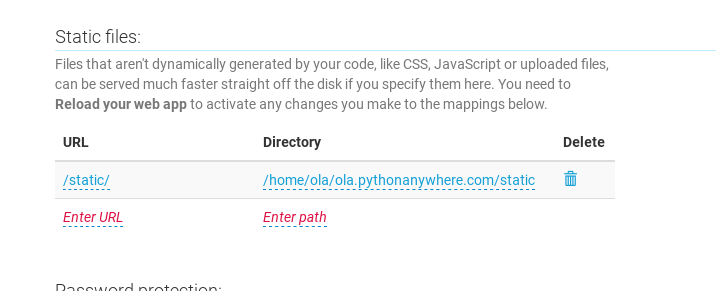

# 파이썬애니웨어(PythonAnywhere) 수동 배포하기

기본 튜토리얼에서 파이썬애니웨어의 "autoconfigure" 스크립트를 통해 우리가 만든 앱을 배포했어요. 여기에는 많은 마법이 있었어요. 심화 튜토리얼에서는 파이썬애니웨어에 수동으로 배포하며 자동으로 설정된 스크립트가 실제로 하는 "무대 뒤"의 일을 알게 될 거에요. 

왜 이 일이 흥미로울까요? 순수한 호기심을 넘어서 언젠가는 다른 호스팅 업체를 통해 나만의 서버에 배포하고 싶어질 거예요. 서버를 띄우는 것뿐만 아니라 수동으로 배포하는 단계를 똑같이 밟아야 할 거예요. 

수동으로 이 절차를 실행해 보는 것도 장고걸스 코치에게는 좋은 아이디어가 될 거예요. 워크숍에서 자동구성 스크립트에 문제가 생길 수도 있을 거예요. 이때 수동으로 실행하는 방법을 알고 있다면 참여자가 배포에 실패했을 때 작동 중인 상태로 되돌리도록 도움을 줄 수 있을 거예요.

자, 그럼 좀 더 알아봐요!


## 가정해 보기

* 아마도 GitHub에 익스텐션의 일부 코드가 있을 거예요. 필요하다면 배포 챕터 시작 부분을 보세요.
* 그리고 파이썬애니웨어 계정도 있을 거예요. 장고걸스 웹앱이 이미 실행 중이라면 삭제를 해야 해요. (아니라면 새 계정으로 회원가입을 해야 해요!)

## 개요

파이썬애니웨어 또는 어느 서버에 배포하든 비슷한 과정을 거치기:

* 서버에서 코드를 가져올 때 `git clone` 과 `git pull` 을 사용할 거예요.

* 서버에 필요한 것들을 설치하기 위해 가상환경을 사용할 거예요. 마치 우리 컴퓨터에 설치했던 것처럼요. 하지만 파이썬애니웨어에서는 `virtualenvwrapper`라 불리는 바로 가기를 사용할 거예요.

* 서버에 데이터베이스 설정을 해주세요. 우리 컴퓨터에 있는 데이터베이스와 서버에 있는 데이터베이스는 별개예요. 이를 위해 `manage.py migrate` 과 `manage.py createsuperuser` 를 실행해 주세요.

* 서버에서 정적파일을 설정해 보도록 할게요. 각자의 랩탑에서는 `runserver` 를 실행해 정적파일을 다루지만, 서버는 정적파일을 최적화해서 다루길 원해요. `collectstatic` 이라는 새로운 명령어를 사용해 파이썬애니웨어의 **Web 탭**을 통해 정적 파일 구성을 해줄 거에요.

* 그리고 실제로 장고앱을 서버와 연결해서 라이브로 인터넷에 공개해요. 우리는 이 과정을 **WSGI 파일**로 불리는 설정으로 파이썬애니웨어의 **Web 탭**으로 할 거예요. 


## 파이썬애니웨어로 코드를 가져오기

[파이썬애니웨어 대시보드](https://www.pythonanywhere.com)로 가볼게요. 우리 컴퓨터에 있는 것과 같은 명령어 실행라인의 파이썬애니웨어 버전인 "Bash" 콘솔을 시작하는 옵션을 선택하세요.


> **Note** 파이썬애니웨어는 리눅스 상에서 돌아가요. 그래서 윈도우 사용자라면 로컬 컴퓨터에서 봤던 화면과 다르게 보일 거예요.

파이썬애니웨어에 있는 "clone"으로 저장소를 생성해서 GitHub을 통해 코드를 가져올 거에요. 파이썬애니웨어의 콘솔에서 아래처럼 타이핑하기:

PythonAnywhere command-line
```
$ git clone https://github.com/<github-사용자-이름>/my-first-blog.git <파이썬애니웨어-사용자-이름>.pythonanywhere.com
```

* `<your-github-username>` 대신 실제 GitHub 사용자 이름으로 변경하세요.
* 그리고 `<your-pythonanywhere-username>`을 파이썬애니웨어에 있는 실제 사용자 이름으로 바꿔주세요.

이 코드는 파이썬애니웨어에 있는 코드를 가져와서 여러분의 미래 웹사이트 주소의 이름을 딴 폴더에 넣어줄거에요. `tree`를 입력해 확인: 

PythonAnywhere command-line
```
$ tree
ola.pythonanywhere.com/
├── blog
│   ├── __init__.py
│   ├── admin.py
│   ├── migrations
│   │   ├── 0001_initial.py
│   │   └── __init__.py
│   ├── models.py
│   ├── tests.py
│   └── views.py
├── manage.py
└── mysite
    ├── __init__.py
    ├── settings.py
    ├── urls.py
    └── wsgi.py
```


### 파이썬애니웨어에 가상환경(virtualenv) 생성하기

로컬 컴퓨터에 했던 것처럼 파이썬애니웨어 상에서도 가상환경을 만들어 주세요. Bash 콘솔 상에서 아래와 같이 타이핑해보기:

PythonAnywhere command-line
```
$ mkvirtualenv --python=python3.6 <your-pythonanywhere-username>.pythonanywhere.com
Running virtualenv with interpreter /usr/bin/python3.6
[...]
Installing setuptools, pip...done.
```

파이썬애니웨어가 추천하는 `mkvirtualenv`는 "virtualenvwrapper"라는 도구에서 왔어요.  
이것은 로컬 컴퓨터에서 배운 `virtualenv` 명령을 기반으로 만들어진 단축 명령어 모음이에요.

명령이 끝나면 가상환경을 활성화 시켜요. 프로젝트 소스코드의 폴더 이름을 짓는 것처럼 미래 웹사이트의 이름을 정했어요. 연습 삼아 가상환경을 비활성화하고 다시 활성화해보세요.

비활성화는 로컬 컴퓨터에서 했던 것처럼 `deactivate`로 하면 될 거예요. virtualenvwrapper 에서는 사용하고 있는 가상환경의 이름만 알면 `workon` 단축 명령어를 사용해서 활성화하기:

PythonAnywhere command-line
```
(ola.pythonanywhere.com) $ deactivate
$  which python
/usr/bin/python
$  workon <your-pythonanywhere-username>.pythonanywhere.com
(ola.pythonanywhere.com) $ which python
/home/ola/.virtualenvs/ola.pythonanywhere.com/bin/python
```

자, 이제 파이썬애니웨어에 있는 가상환경에 장고를 설치해 볼 거에요.

PythonAnywhere command-line
```
(ola.pythonanywhere.com) $ pip install 'django<2'
Collecting django
[...]
Successfully installed django-1.11.9
```

> **Note** `pip install` 단계는 몇 분 정도 걸릴 거에요. 인내심을 갖고 기다려야 해요! 하지만 5분 이상 걸린다면 뭔가 잘못된 거니 코치에게 물어보세요.

<!--TODO: think about using requirements.txt instead of pip install.-->


### 파이썬애니웨어에 데이터베이스 생성하기

우리의 컴퓨터와 서버 사이에는 차이점이 있습니다. 그래서 로컬 컴퓨터와 서버의 사용자 계정과 게시물은 달라요.

우리 컴퓨터에서 했던 것처럼 `migrate` 와 `createsuperuser`로 데이터베이스를 초기화해주는 단계를 다시 반복해 볼 거예요.

Bash 콘솔로 가서 가상환경이 여전히 활성화된 상태인지 확인하고 다음 명령어를 실행해 보세요. (콘솔을 닫았다면 다시 열고 `workon`을 통해 가상환경을 활성화할 수 있습니다.)

PythonAnywhere command-line
```
(ola.pythonanywhere.com) $ python manage.py migrate
Operations to perform:
[...]
  Applying sessions.0001_initial... OK
(ola.pythonanywhere.com) $ python manage.py createsuperuser
```

### 정적파일 모으기

이제 우리는 `collecstatic`라는 새로운 명령어를 배웠어요. 이 명령은 우리의 앱이 (우리가 만든 *블로그*와 내장된 앱인 *관리페이지*를 포함하여) 모든 정적 파일을 수집하도록 해서 서버가 찾을 수 있는 장소에 모아둠:

PythonAnywhere command-line
```
(ola.pythonanywhere.com) $ python manage.py collectstatic
You have requested to collect static files at the destination
[...]
Are you sure you want to do this?
[...]
62 static files copied to '/home/ola/ola.pythonanywhere.com/static'.
```


## 블로그를 웹앱으로 게시하기

이제 코드가 파이썬애니웨어에 있고 가상환경도 준비가 되고 데이터베이스도 초기화시켰어요. 이제 웹앱으로 게시할 준비가 되었어요.

로고를 클릭해서 파이썬애니웨어의 대시보드로 돌아온 다음 **Web** 탭을 클릭해주세요. 마지막으로 **Add a new web app**을 클릭해 주세요.

도메인 이름을 확인한 후에 대화상자에서 **수동 설정(manual configuration)** (N.B. – 가 *아니라* "장고" 옵션)을 선택해 주세요. 그런 다음 **Python 3.6**을 선택하고 다음을 클릭해서 설정을 완료하세요.

> **Note** "장고"가 아닌 "수동 설정" 옵션을 선택하세요. 파이썬애니웨어의 기본 장고 설정은 너무 멋져요. ;-)


### 가상환경 설정하기

웹앱의 파이썬애니웨어 설정 화면으로 이동합니다. 서버에 있는 앱을 변경하고자 할 때는 이 화면으로 가야 해요.

 

"Virtualenv" 부분에서 "Enter the path to a virtualenv"라는 붉은 텍스트를 클릭하고 `/Web 탭home/<your-PythonAnywhere-username>/my-first-blog/myvenv/`를 입력하세요. 경로를 저장하려면 체크 표시가 있는 파란색 상자를 클릭해 주세요.

> **Note** 파이썬애니웨어에서 적당한 사용자 이름으로 변경하세요. 입력할 때 실수가 있다면 파이썬애니웨어에서 경고 알림을 표시해 줍니다.


### 정적파일 매핑 추가하기

파이썬애니웨어에게 `/static/` 어떤 URL 하위에 정적 파일들이 위치할지 알려줘야 해요. Web 탭에 "Static Files(정적 파일)"에서 이 작업을 해요.

"Enter URL"이라는 빨간색 텍스트를 클릭하고 `/static/`이라고 입력해요. 그리고 파란색 체크박스를 클릭해서 저장해 주세요. 그리고 "Enter path"라는 텍스트를 클릭 하고 다음과 같이 입력 `/home/<파이썬애니웨어-사용자-이름>/<파이썬애니웨어-사용자-이름.pythonanywhere.com/static`(보통 자신의 사용자 이름): 




### WSGI 파일 설정하기

장고는 파이썬애니웨어가 지원하는 파이썬의 "WSGI 프로토콜"을 사용하여 웹사이트를 서빙합니다. WSGI 설정파일을 편집해서 파이썬애니웨어가 장고 블로그를 인식하도록 합니다.

"WSGI 설정 파일"링크(페이지 상단의 "Code" 부분 근처에 이런 형태의 경로가 있음 `/var/www/<your-PythonAnywhere-username>_pythonanywhere_com_wsgi.py`)를 클릭하세요. 
에디터가 열릴 거예요.

모든 내용을 지우고 아래의 내용으로 변경:

&lt;your-username&gt;_pythonanywhere_com_wsgi.py
```python
import os
import sys

path = '/home/<your-pythonanywhere-username>/<your-pythonanywhere-username>.pythonanywhere.com')
if path not in sys.path:
    sys.path.append(path)

os.environ['DJANGO_SETTINGS_MODULE'] = 'mysite.settings'

from django.core.wsgi import get_wsgi_application
application = get_wsgi_application()
```

> **Note** 먼저 했던 것처럼, 파일에서 자신의 파이썬애니웨어 사용자 이름으로 변경하세요.

이 파일은 파이썬애니웨어에게 우리의 앱이 있는 곳과 장고 설정 파일의 이름을 알려줘요.

**저장(Save)**을 클릭하고 **Web** 탭으로 갑니다.

이제 거의 다 됐어요! 큰 초록색의 **Reload** 버튼을 누르면 우리의 애플리케이션을 볼 수 있어요. 페이지 상단에 링크가 있어요. 


## 디버깅팁

사이트를 방문했을 때 오류가 표시되면 디버깅 정보를 찾아봐야 하는데요. 첫 번째로 볼 위치는 **오류 로그**예요. 파이썬애니웨어의 [Web 탭](https://www.pythonanywhere.com/web_app_setup/)에서 찾을 수 있어요. 만약 오류 메시지를 발견하게 된다면 가장 마지막에서 최근의 오류를 발견할 수 있을 거예요. 보통 이런 문제들:

- 우리가 콘솔에서 했던 무언가를 잊어버림: 가상환경 만들기와 활성화하기, 그리고 그 안에 장고를 설치하기, 데이터베이스 마이그레이션

- Web 탭 상의 가상환경 경로 실수 – 문제가 있다면 빨간색의 오류 메시지가 표시될 거예요.

- WSGI 설정 파일을 잘못 작성한 경우 – my-first-blog 폴더의 경로가 올바른가요?

- 우리가 만들었던 웹 앱에서 사용했던 가상환경의 파이썬 버전이 같은가요? 둘 다 3.6이어야 합니다.

[파이썬애니웨어 위키의 일반적인 디버깅 팁](https://www.pythonanywhere.com/wiki/DebuggingImportError)도 참고해 주세요.

